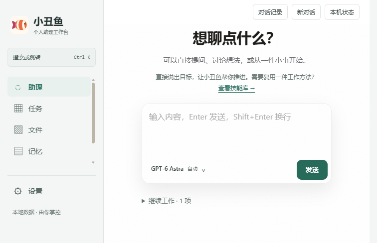
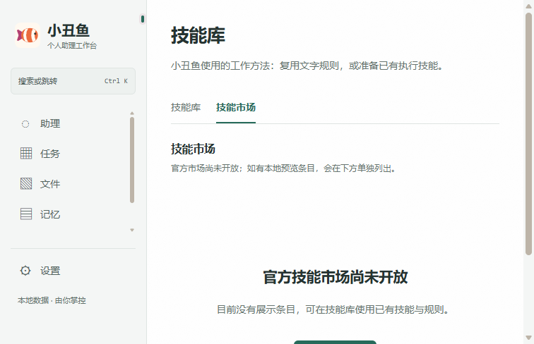
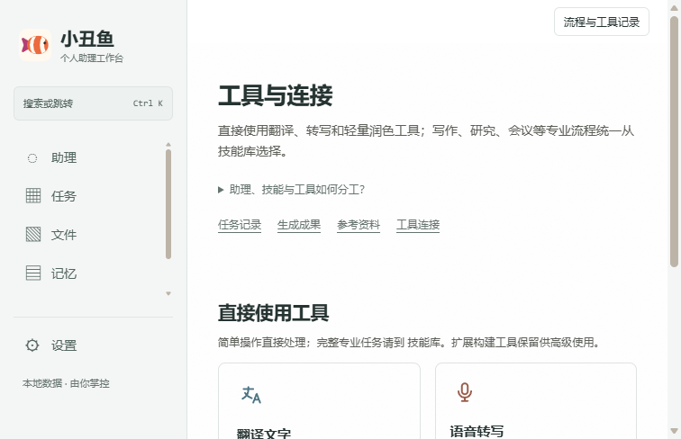
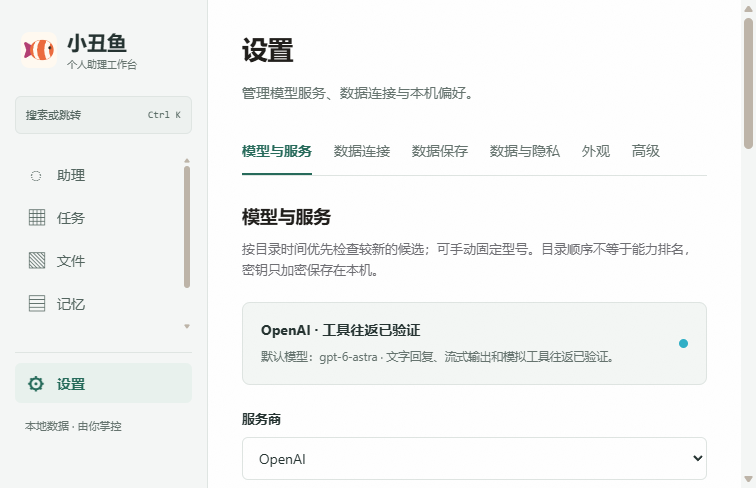

# Clownfish

[中文](README.md) · **English**

[](https://github.com/mmlong818/nemos/actions/workflows/ci.yml)
[](https://github.com/mmlong818/nemos/tree/v0.5.5)
[](LICENSE)
[](#run-locally)

Clownfish is a **local-first AI work application with long-term memory and real task execution**. The user describes an outcome; Clownfish selects capabilities, coordinates internal specialists, and works with files while retaining the complete task history.

See the [Privacy Policy](PRIVACY.en.md) for local storage, external-service, synchronization, export, and deletion boundaries.

## Product overview

Clownfish consolidates Tasks, Bots, Capabilities, Files, Memory, and Model Settings into one personal AI assistant workbench. It provides a local Bot market, task-level routing, bounded text collaboration, model queue visibility and cancellation, delivery receipts, shared materials, and local-first storage. The legacy development engine is outside the current product scope.



## Main surfaces

| Surface | User action | Outcome |
| --- | --- | --- |
| **Tasks** | Describe a goal and attach images or files | Persistent task, progress, automatic title, and results |
| **Capabilities** | Auto-select or directly launch specialized work | Structured research, documents, presentations, analysis, and design |
| **Files** | Open office files, convert, edit, process, and export | Original, editable copy, versions, and new exports |
| **Automations** | Manage repeated work | Pausable, editable, and manually runnable schedules |
| **Settings** | Configure models, engines, connectors, and storage | Encrypted configuration and verified connection state |

All surfaces share task, attachment, decision, and artifact identities. A handoff carries the full source text, a deduplicated summary, attachments, and prior decisions rather than only the latest message.

## Tasks and collaboration

### Assistant, Bot, capability, and tool

- **Assistant** is the user-facing coordinator that understands goals and delivers results.
- **Bot** is a reusable role and instruction set, such as plant care, meeting preparation, or project follow-up.
- **Capability** is an executable end-to-end workflow, such as document conversion, research, presentation generation, or file analysis.
- **Tool** is one concrete operation, such as reading a file, calling a model, or using a connector.

The Bot market contains curated templates shipped with the application. It does not mirror Grok, sync a Grok account, download third-party scripts, or carry private Bot memory.

A new task can be a normal conversation, outcome-oriented work, or guided study. Clownfish remains the single user-facing coordinator. Specialists are internal execution units selected again when the topic changes; users do not need to configure or chat with them individually.

Runs retain checkpoints, cancellation, failure reasons, retry paths, and delivery receipts. Execution and delivery are recorded separately so a refresh or restart does not turn an undelivered result into a false completion.

## Capabilities

Clownfish currently includes 23 built-in capabilities across:

- research, source verification, decisions, and market briefings;
- documents, conversion, OCR, meeting minutes, editing, and HTML reports;
- presentations, product design, and image-prompt reconstruction;
- operator workspaces, group progress, workflows, business development, and market simulation;
- reusable capability creation.

Capabilities can continue one another while keeping the original task context. Volatile prices, ticket inventory, room availability, and reservations are confirmed only when a reliable live source actually returns them. The product does not currently ship transaction adapters for rail, flights, hotels, or restaurants.

Settings offers four optional bundled plugins: official Playwright MCP browser control, safe CSV/JSON analysis, local EML/ICS file parsing, and image/video generation through a user-provided OpenAI-compatible media endpoint. Analysis and file parsing are local; browser control needs local Chrome; media generation needs the user's own API.



## File workbench

The workbench supports Word, PowerPoint, Excel, PDF, OpenDocument, RTF, EPUB, CSV, TXT, and Markdown.

Its boundary is explicit: **keep the original, edit a converted working copy, and export a new file.**

- Word conversion preserves supported headings, paragraphs, blank lines, spaces, indentation, numbering, tables, and alignment;
- PDF converts through AnyDoc into an editable Markdown copy; scanned PDFs still require OCR;
- PowerPoint retains per-slide text, tables, and speaker notes; Excel retains worksheet tables;
- TXT and Markdown may be written back only after authorization and conflict checks;
- other formats never overwrite the original and report conversion changes;
- autosave, version comparison, restore, trash, and standalone export are supported;
- exports include DOCX, PDF, PPTX, XLSX, HTML, and Markdown.

Complex floating objects, comments, cross-section headers and footers, formulas, charts, slide masters, and spreadsheet formulas still rely on the original or desktop Office/WPS for fidelity.



## Memory, models, and storage



The memory core comes from the independent [`@nemos/sdk`](https://github.com/mmlong818/nemos-memory) dependency. User facts, persona self-memory, task context, and specialist execution remain separated. Capabilities may apply a small number of delivery preferences or disable them for one run; the current request always wins.

Model presets cover Zhipu GLM, OpenAI, Anthropic Claude, DeepSeek, Alibaba Qwen, MiniMax, and custom OpenAI/Anthropic-compatible services. Windows credentials are encrypted for the current user with DPAPI and are never echoed in full.

The default data directory is `~/.clownfish`. Storage is local by default. The included Docker service can receive AES-256-GCM encrypted snapshots while the local copy remains the working database.

```powershell
$env:CLOWNFISH_SYNC_TOKEN="replace-with-a-random-token-of-at-least-24-characters"
docker compose up -d --build
```

Local Docker may use `http://127.0.0.1:8799`; remote deployment requires HTTPS.

## Verified status

As of 2026-09-07:

- build and type checking pass;
- workbench, model scheduling, Bot market, autonomous collaboration, and file workflows have unit and isolated integration coverage;
- Pi Agent is upgraded to **0.84.2**, with the build and engine-specific tests passing;
- official Playwright MCP tool discovery and the media connector lifecycle are covered by executable tests;
- document conversion, Office export, task recovery, and encrypted sync have automated coverage.

Tests validate specific code paths; they do not imply manual verification of every external model account, live data source, or complex Office layout.

## Run locally

Node.js 22.19 or newer is required.

```powershell
cd sdk\typescript
npm install
npm run companion
```

Open <http://localhost:8787>. Use `PORT` to change the port and `CLOWNFISH_HOME` to change the data directory.

### Windows portable client

```powershell
cd sdk\typescript
powershell -NoProfile -ExecutionPolicy Bypass -File examples\companion\client\Build-Clownfish.ps1
```

Output: `examples\companion\client\dist\portable\小丑鱼`.

## Documentation

| Document | Purpose |
| --- | --- |
| [Application guide](sdk/typescript/examples/companion/README.md) | Pages, data, endpoints, and desktop builds |
| [TypeScript integration](sdk/typescript/README.en.md) | Agent runtime exports and memory APIs |
| [Memory architecture](docs/architecture-overview.md) | Implemented structure and boundaries |
| [Agent runtime](sdk/typescript/examples/companion/docs/agent-runtime-design.md) | Tasks, tools, permissions, and recovery |
| [Documentation index](docs/README.en.md) | Public documentation entry point |
| [Security policy](SECURITY.md) | Vulnerability reporting |

## Licensing

[LICENSING.md](LICENSING.md) is authoritative:

- the TypeScript integration, Agent runtime, and public research material use [PolyForm Noncommercial 1.0.0](LICENSE);
- the independent `@nemos/sdk` memory core follows its own repository license;
- the Clownfish application under `sdk/typescript/examples/companion/` is all rights reserved under its [separate notice](sdk/typescript/examples/companion/LICENSE).
