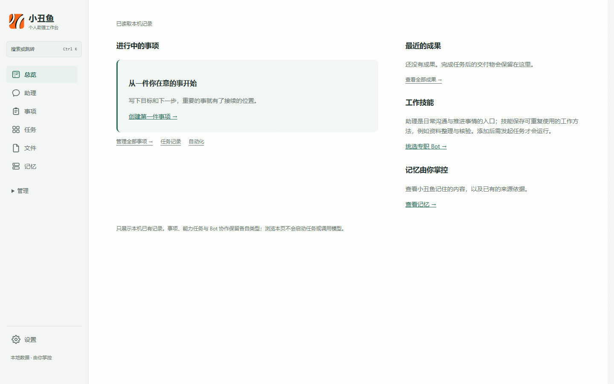
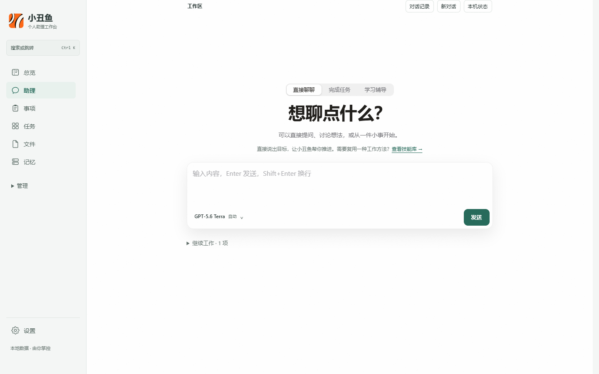
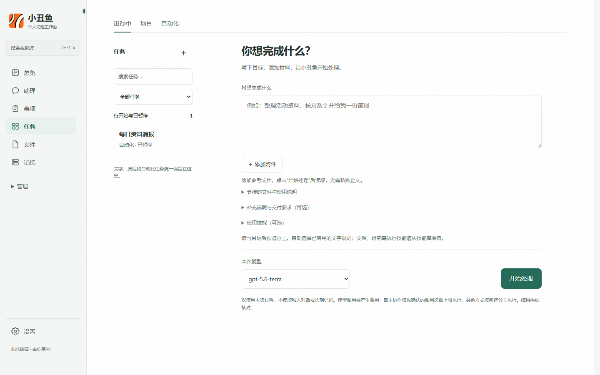
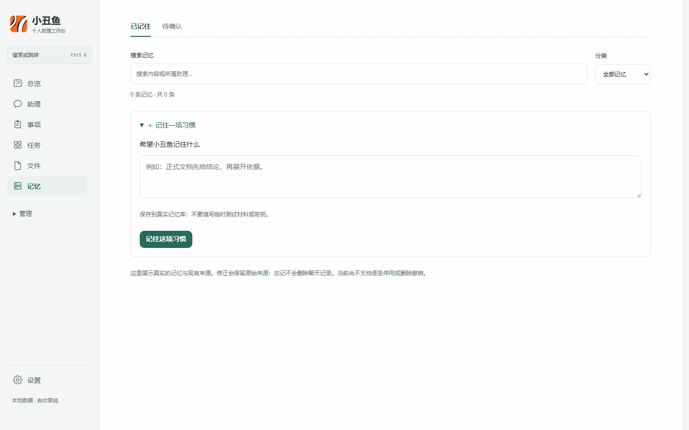
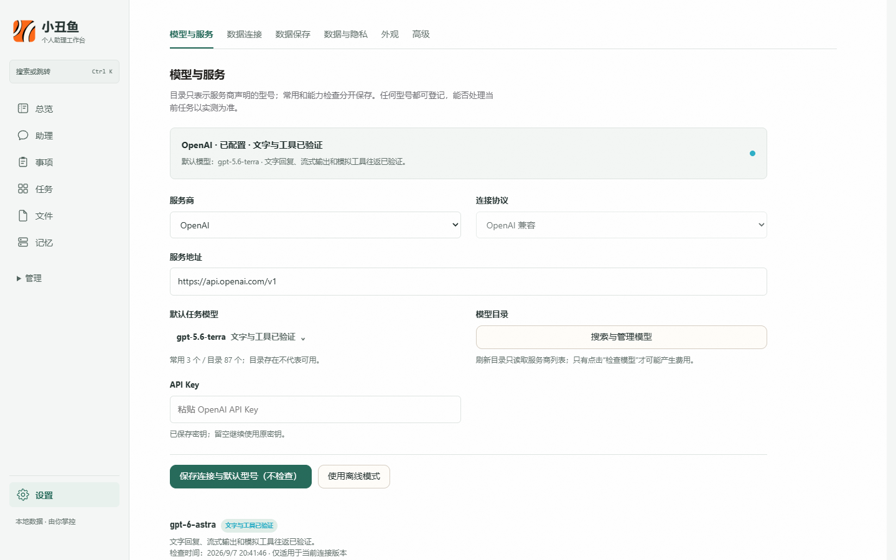

# Clownfish

> A local-first personal AI assistant workbench. Goals, execution, files, verification, and long-term memory stay in one workspace.

[中文](README.md) · **English**

[](https://github.com/mmlong818/nemos/actions/workflows/ci.yml)
[](https://github.com/mmlong818/nemos/tree/v0.7.6)
[](#run-locally)
[](ROADMAP.md)
[](LICENSE)

> [!IMPORTANT]
> This repository uses [PolyForm Noncommercial 1.0.0](LICENSE), which is not an OSI-approved open-source license. Noncommercial use, modification, and redistribution are allowed; commercial use requires a separate license. Third-party components retain their own terms. See [LICENSING.md](LICENSING.md) and [THIRD_PARTY_NOTICES.md](THIRD_PARTY_NOTICES.md).



> Every interface image below was captured from the current running local service. None is a concept mockup or an old prototype.

## Product overview

A chat window can answer a question but is a poor place to manage ongoing work. Clownfish puts the main objects of a personal assistant into one traceable workbench:

- **Assistant** talks with the user, clarifies the goal, chooses a working mode, and delivers one integrated result;
- **Matters** hold goals, next actions, and outcomes that need ongoing attention;
- **Tasks** are concrete queued executions with status, attachments, progress, and receipts;
- **Bots / skills** are reusable roles and working methods, not separate models or arbitrary downloaded scripts;
- **Capabilities / tools** separate an end-to-end workflow from one permission-bound operation inside it;
- **Memory** is long-term information the user can inspect, confirm, correct, and forget.

The normal path is: **tell the assistant the goal → select skills and capabilities → queue or coordinate execution → verify and deliver → place useful information into memory only when appropriate**. The queue serializes work when a provider cannot handle concurrent requests; multi-Bot collaboration is used only when the task benefits from it.



## What works today

### Tasks and collaboration

The task page is the primary execution surface. Enter a goal, attach source files, select a model, or let the application select an enabled skill. An attachment is stored as the original file first; merely selecting it does not extract and paste its text.

Runs retain checkpoints, cancellation, failure reasons, and delivery receipts. Completed, waiting for input, blocked, cancelled, and uncertain side-effect states stay distinct. Empty output is not reported as success, and reloading the page does not turn an undelivered result into a delivered one.

For team tasks, the user may add or redirect instructions between stages. Once final synthesis has started, the application rejects additions it cannot honestly incorporate instead of pretending they were used.



### Skills, capabilities, and files

The skill library stores reusable methods that can be searched, inspected for provenance and boundaries, and edited. User changes and bundled template versions are tracked separately.

The skill market is reserved for future official distribution and **currently contains no online listings**. Clownfish does not connect to a Grok Bot account, sync third-party private memory, or bundle another Bot's original prompts, scripts, or plugins.

The capability center covers research, documents, presentations, analysis, design, and office-file workflows. The file workbench follows a simple boundary: keep the original, edit a working copy, and export a new file.

- Imports include common Word, PowerPoint, Excel, PDF, OpenDocument, RTF, EPUB, CSV, TXT, and Markdown files;
- exports include DOCX, PDF, PPTX, XLSX, HTML, and Markdown;
- TXT and Markdown can be written back only after explicit authorization and conflict checks; other formats do not overwrite the original;
- complex floating objects, comments, formulas, charts, masters, and macros still rely on the original and desktop Office or WPS for fidelity.

“Installable” does not mean “ready.” Settings reports installation, local dependencies, external configuration, and actual verification separately:

- safe CSV / JSON analysis and EML / ICS parsing run locally; file parsing does not connect an online mailbox or calendar;
- browser control needs the bundled Playwright MCP plus a locally installed Chrome, Edge, or Chromium;
- image and video generation needs the user's compatible endpoint and key; configuration alone remains marked unverified.

### Memory

Memory separates remembered information from pending learning proposals. A pending proposal enters long-term memory only after explicit confirmation; remembered content can be traced to its source, corrected, or forgotten.

Ordinary tasks recall only information relevant to the current goal, and the current request always outranks historical preferences. User facts, assistant self-memory, and task context are stored separately. The memory core comes from the independent [`@nemos/sdk`](https://github.com/mmlong818/nemos-memory) dependency; this repository does not keep a second copy.



### Models

Connections can target OpenAI, Anthropic Claude, Zhipu GLM, DeepSeek, Alibaba Qwen, MiniMax, and custom OpenAI- or Anthropic-compatible services. A provider catalog is for **discovering candidates**; its entries are not automatically qualified to execute tasks.

- Any model identifier can be registered, but text and tool capabilities appear only after an explicit check;
- a check may incur a small provider charge, so it runs only after the user asks for it;
- catalog size, release date, and model name do not replace capability verification;
- a task can select model and reasoning effort, and a tool-requiring task does not silently fall back to a text-only model.

The call ledger stores purpose, model, state, latency, and provider-reported usage. Missing usage remains unknown; the application does not guess cost or store full prompts, responses, or keys in the ledger.



## Run locally

Requires **Node.js ≥ 22.19**. Windows is the primary target. Linux and macOS can run the web service, but API-key persistence currently depends on Windows DPAPI and is unavailable outside Windows; see the [known limitation](docs/model-key-storage-non-windows-2026-09-08.md).

```powershell
git clone https://github.com/mmlong818/nemos.git
cd nemos\sdk\typescript
npm install
npm run companion
```

Open <http://localhost:8787> and save a connection under **设置 → 模型与服务** (Settings → Models & Services). Without a configured model, the application can still display local data but issues no model requests. The interface is currently primarily Chinese.

| Variable | Purpose | Default |
| --- | --- | --- |
| `PORT` | Web-service port | `8787` |
| `CLOWNFISH_HOME` | User-data directory | `~/.clownfish` |
| `CLOWNFISH_SYNC_TOKEN` | Optional self-hosted sync token | unset |

### Windows portable client

```powershell
cd sdk\typescript
powershell -NoProfile -ExecutionPolicy Bypass -File examples\companion\client\Build-Clownfish.ps1
```

The output is `examples\companion\client\dist\portable\小丑鱼`. The portable package is a desktop shell; model configuration and user data still use local storage.

## Data and security boundaries

- The web service listens on `127.0.0.1` by default, and user data is stored under `~/.clownfish`;
- Windows encrypts model credentials for the current user with DPAPI, and APIs never echo a complete key;
- opening a page does not send attachments, tasks, or memory to a model; relevant selected material may leave the machine only when a task actually runs against the configured provider;
- extensions and tools are subject to permission, network, and runtime auditing; the UI states when a capability needs local processes or external access;
- the optional sync service stores AES-256-GCM encrypted snapshots while the local copy remains authoritative; remote deployment requires HTTPS.

```powershell
$env:CLOWNFISH_SYNC_TOKEN="replace-with-a-random-token-of-at-least-24-characters"
docker compose up -d --build
```

See [PRIVACY.en.md](PRIVACY.en.md) for storage and deletion rules. Report security issues privately as described in [SECURITY.md](SECURITY.md).

## Current limitations

- The product is **Alpha**; data models and public APIs may change;
- the UI is primarily Chinese, and desktop capabilities are primarily verified on Windows;
- the official skill market is not open; no ordinary-user built-in account connectors are provided for online email, calendars, GitHub, or enterprise documents;
- no built-in adapter performs live rail, flight, hotel, or restaurant transactions; a live result is marked confirmed only after a reliable source returns it;
- external models, media services, and complex Office files depend on the environment, so automated coverage is not proof that every account, model, or layout has been manually verified;
- a task waiting for input or blocked normally needs a new task to continue today; mid-run steering is not arbitrary lossless resume at every stage.

## Repository layout

| Directory | Contents |
| --- | --- |
| [`sdk/typescript/`](sdk/typescript/) | TypeScript integration and auditable Agent runtime |
| [`sdk/typescript/examples/companion/`](sdk/typescript/examples/companion/) | Clownfish server, web interface, capabilities, and client |
| [`sync-service/`](sync-service/) | Optional self-hosted encrypted synchronization |
| [`docs/`](docs/) | Current architecture, decisions, operations, and verification notes |
| [`bench/`](bench/) | Memory benchmarks and frozen results |
| [`spec/`](spec/) · [`rfcs/`](rfcs/) · [`archive/`](archive/) | Archived early specifications, RFCs, and process material |

## Verification and development

The current revision has build and type checks plus **841 automated tests with no failures**. Tests that require Blender or platform-specific facilities are explicitly skipped when those facilities are unavailable. This count describes covered code paths, not manual acceptance of every external service.

```powershell
cd sdk\typescript
npm run check
cd ..\..
node scripts\verify-docs.mjs
```

See the [application guide](sdk/typescript/examples/companion/README.md), [Agent runtime design](sdk/typescript/examples/companion/docs/agent-runtime-design.md), and [documentation index](docs/README.en.md). Contributions are welcome, but a new capability needs a real implementation and verification rather than copy or prompts alone. Start with [CONTRIBUTING.md](CONTRIBUTING.md).
