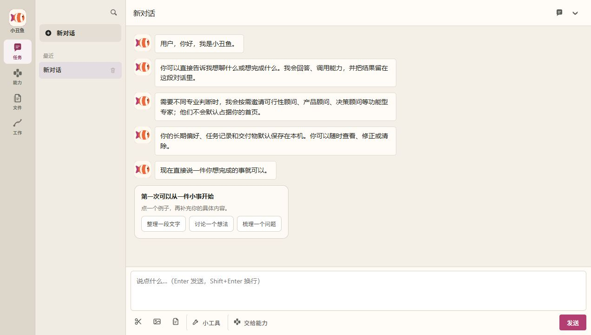
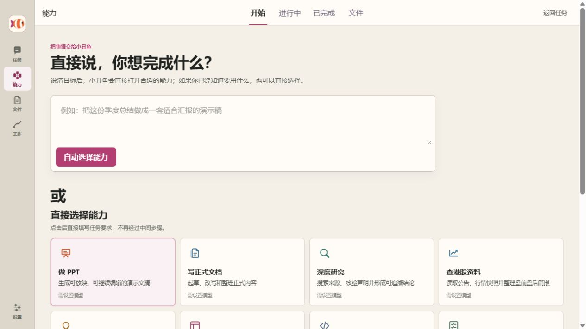
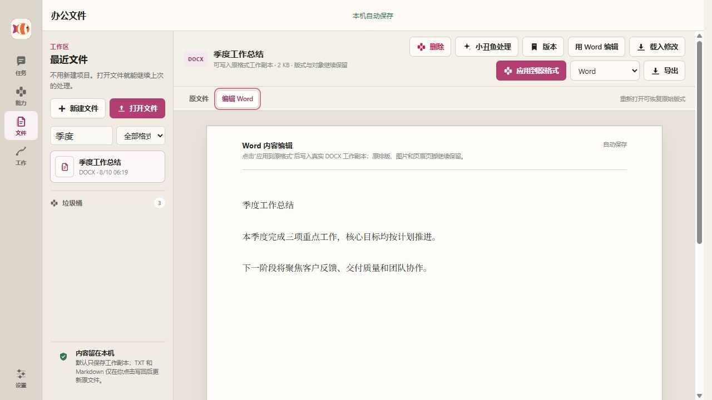
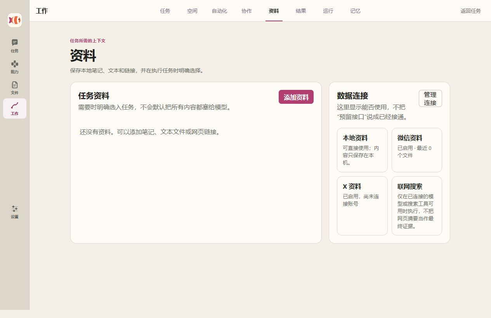
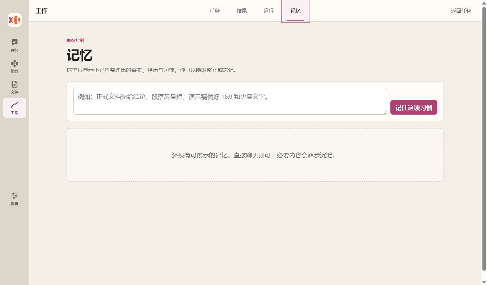
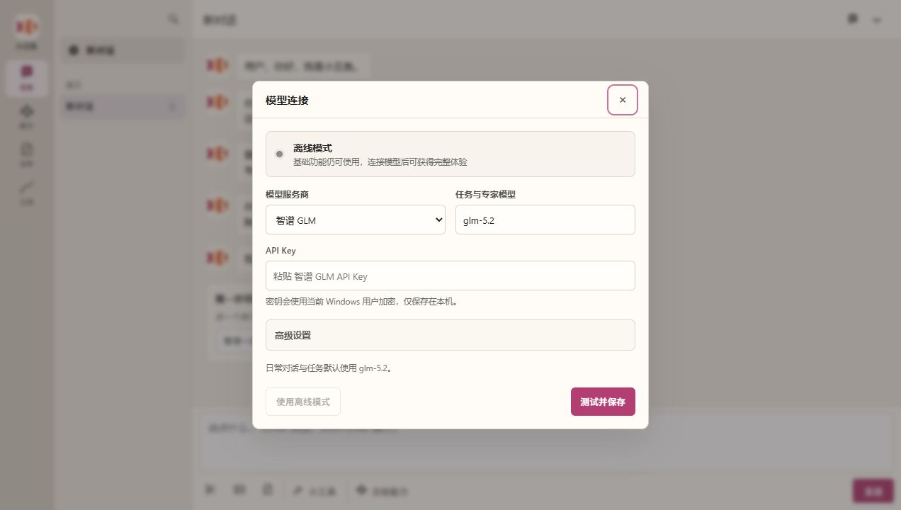

# Clownfish

[中文](README.md) · **English**

> A local-first AI work application with long-term memory. Start with a new conversation, switch to task completion or guided study when needed, and continue complex work in Capabilities, Files, and Work.

## What it does today

Clownfish combines four everyday surfaces:

| Surface | User action | Current implementation |
|---|---|---|
| **Chat** | Create, search, switch, or delete independent conversations; upload images or files; and choose the right work mode | Automatic titles, parallel threads, isolated context, and delivery back to the originating conversation |
| **Capabilities** | Describe an outcome or choose a capability directly | Background jobs, live progress, cancellation, retries, previews, and downloads |
| **Files** | Open Word, PowerPoint, Excel, PDF, TXT, or Markdown | Original-format working copies, Word body editing, slide-by-slide text editing, spreadsheet cells and formulas, and version history |
| **Work** | Review tasks, workspaces, automations, collaboration, resources, results, runs, and memory | Multi-task organization, scheduled execution, expert review, local resources, artifacts, and preference management |

New users do not need to create a project or understand tool names first.

## Conversations: one entry, three ways of working

Every new conversation begins as a blank thread with three modes:

- **Chat** for questions, discussion, ideas, and everyday conversation;
- **Task** for sustained work toward a concrete outcome, with capabilities and expert judgment invoked behind the scenes;
- **Study** for explanation, guided questions, practice, and feedback without requiring the user to choose a teacher persona.

The left side follows a familiar work-app pattern: the product name sits below its icon, New Conversation remains at the top, and search expands only when requested. Search covers every conversation and returns to the exact matching message, while each conversation keeps its own unsent draft. After the first message, a lightweight daily model generates a short title in the background. If the model is unavailable, a local fallback names the thread without blocking the reply or writing the title request into long-term memory.

Experts and teaching personas are internal execution choices rather than contacts that users must configure. When a conversation hands work to a capability, both the original text and a distilled task context are transferred instead of only the final sentence.

## Capabilities: describe the goal or choose directly

The capability page supports two equal paths:

1. Describe the outcome and let Clownfish choose from the goal, attachment formats, and project workspace;
2. Select a capability directly when you already know what you need.

Selection opens the task form immediately, without an extra preparation step. Jobs continue in the background and remain available locally.

Built-in capabilities cover presentation creation, formal documents, deep research, Hong Kong market briefs, complex-problem framing, product interface design, project development, meeting minutes, web reports, option comparison, business development, market opportunity simulation, and new-capability generation.

Outputs include PPTX, DOCX, PDF, XLSX, HTML, Markdown, and structured data.

## Files: original, working copy, and result stay together

The file workspace supports DOCX, PPTX, XLSX, PDF, TXT, and Markdown:

- New and open actions sit above recent files;
- The original stays local and is never overwritten by editing;
- Markdown has an outline, formatting tools, and live preview; TXT uses continuous text editing;
- Working copies are saved by the local service, and revision checks prevent stale windows from overwriting newer edits;
- PDFs retain their original layout; Office formats receive a structured preview while the original file is retained;
- Word body edits can be applied to the real DOCX working copy while existing paragraph formatting, images, headers, and footers stay in place;
- PowerPoint uses a slide filmstrip and page-level text editor while preserving existing text boxes, images, and layouts;
- Excel provides sheet tabs, editable cells, formulas, and deterministic numeric summaries while retaining existing cell styles;
- TXT and Markdown can be written back only after explicit authorization and an external-change conflict check;
- Editing, versions, AI progress, and results stay on the same page;
- The file library supports name search and format filters; external edits, renames, moves, and deletions are recorded as file events;
- Chat attachments, capability artifacts, and the file workspace share a stable file identity instead of cloning the same file at each handoff;
- A selected excerpt is handed off with its location, original text, complete file, and stable file identity;
- Results created in chat or by a capability can open as a local working copy for continued editing;
- Deleted working files move to a recoverable trash area before permanent deletion;
- Results can be exported to DOCX, PDF, PPTX, XLSX, HTML, or Markdown.

## Work: ongoing tasks and deliverables in one place

Capability runs and ongoing work are kept in the Work center:

- **Tasks** retain the goal, plan, current progress, and next action;
- **Workspaces** keep related tasks and results together, with archive and restore controls;
- **Automations** manage daily and usage-frequency tasks, including pause, edit, and run-now actions;
- **Collaboration** lets Clownfish choose experts dynamically and merge their reviews into one final delivery;
- **Resources** stores local notes, text files, and links; only explicitly selected items enter a task context;
- **Results** collect files and reports created by capabilities;
- **Runs** preserve execution state, logs, and errors;
- **Memory** lets the user review facts, experiences, and habits organized by Clownfish.

A one-off run started from a conversation or the Capabilities page keeps its source, execution state, and artifact. Continuing that result stays in the same task and creates a linked next version. Failed runs keep their error and retry path, and a one-off task can be converted into a daily or usage-frequency task.

New users can still begin in a conversation without creating a workspace. Workspaces only appear when one piece of work grows into multiple related tasks.

The resource library is local by default. WeChat sources, X, and web search show their actual connection state instead of presenting planned adapters as live integrations.

## Memory: focused, visible, and user-controlled

Clownfish uses the Nemos Memory SDK in this repository. The application currently:

- Separates user memory from each role's own memory namespace;
- Stores source conversation records in a protected archival layer and uses categorized memories for recall;
- Recalls task-relevant context for normal chat;
- In preference-only capability mode, searches procedural and personal-semantic memory and applies at most six matching items;
- Task records show which habits were applied, while a single task can disable preference memory entirely;
- Lets users add an explicit habit and forget an individual categorized memory;
- Preserves archival records when categorized memories are forgotten or cleared.

Writing, layout, and format preferences supplement the current request; they do not replace it.

See the [TypeScript SDK](sdk/typescript/README.en.md) and the [v0.7 implementation design](sdk/typescript/docs/nemos-memory-v0.7-design.md) for the memory lifecycle and APIs.

## Provider-neutral model connection

Open **Model connection**, then choose a provider and model name and enter an API key. Clownfish tests the connection before saving it.

Clownfish follows provider presets when routing models. Providers with a separate daily-chat model use it automatically, while experts, capabilities, file generation, and complex work use the configured task model. When no separate route is defined, both use the same model.

Presets are available for Zhipu GLM, OpenAI, Anthropic Claude, DeepSeek, Alibaba Qwen, MiniMax, and custom services. OpenAI-compatible and Anthropic-compatible protocols are supported. Vision, web, and embedding support depends on the selected service and model.

On Windows, secrets are encrypted with DPAPI for the current user and full keys are never returned by the API. Offline mode keeps the interface and local-only functions available.

## Data and privacy boundaries

- New installations store memory, tasks, runs, working copies, and artifacts under **~/.clownfish**. If legacy **~/.nemos-companion** data is detected, Clownfish keeps using it to avoid losing content during migration.
- When a configured model is called, the request and required context are sent to that provider. After the first message in a new conversation, the same provider's lightweight daily model also receives that message to generate a short title; this title request uses no tools and is not written to long-term memory. Network source features contact their corresponding public services when used.
- Logs and run records redact common credential fields, but secrets should never be placed in task text.
- Before exporting or sharing a backup or portable package, check that it does not contain a user data directory.

## Current verification

- The TypeScript build passes;
- All 570 automated tests pass;
- Chat, Capabilities, Files, Work, Memory, and Model connection were rechecked and recaptured with a fresh local data directory;
- See the [2026-08-08 ten-round real-world audit](sdk/typescript/examples/companion/docs/reviews/2026-08-08-web-true-check-10-rounds.md).

## Run locally

Node.js 22.19 or newer is required.

~~~powershell
cd sdk\typescript
npm install
npm run companion
~~~

The default URL is <http://localhost:8787>. Use **PORT** to change the port and **CLOWNFISH_HOME** to change the data directory.

### Windows portable client

~~~powershell
cd sdk\typescript
powershell -NoProfile -ExecutionPolicy Bypass -File examples\companion\client\Build-Clownfish.ps1
~~~

The build downloads and verifies WebView2 plus the sandboxed Node and Python runtimes. Output:

~~~text
examples\companion\client\dist\portable\小丑鱼
~~~

## Use the memory SDK independently

~~~typescript
import { Nemos } from "@nemos/sdk";

const nemos = new Nemos({
  storage: { type: "sqlite", path: "./memory.db" },
  llm,
});

const memory = nemos.forUser(authenticatedUserId);
await memory.ingest("The user says: formal documents should lead with the conclusion.");
const context = await memory.getRelevantContext("Draft a proposal");
~~~

**userId** must come from a trusted server-side identity, not an untrusted client parameter.

## Documentation

| Document | Purpose |
|---|---|
| [Clownfish guide](sdk/typescript/examples/companion/README.md) | Startup, data directory, desktop build, and endpoints |
| [TypeScript SDK](sdk/typescript/README.en.md) | Current memory APIs |
| [Memory architecture](docs/architecture-overview.md) | Implemented structure and boundaries |
| [Runtime architecture](sdk/typescript/examples/companion/docs/agent-runtime-design.md) | Tasks, tools, permissions, and recovery |
| [Roadmap](ROADMAP.md) | Current versions and next priorities |
| [Documentation guide](docs/README.en.md) | Product, integration, architecture, and research documents |

## License

This project uses the [PolyForm Noncommercial License 1.0.0](LICENSE). Noncommercial use, modification, and distribution are allowed; commercial use requires separate permission.
