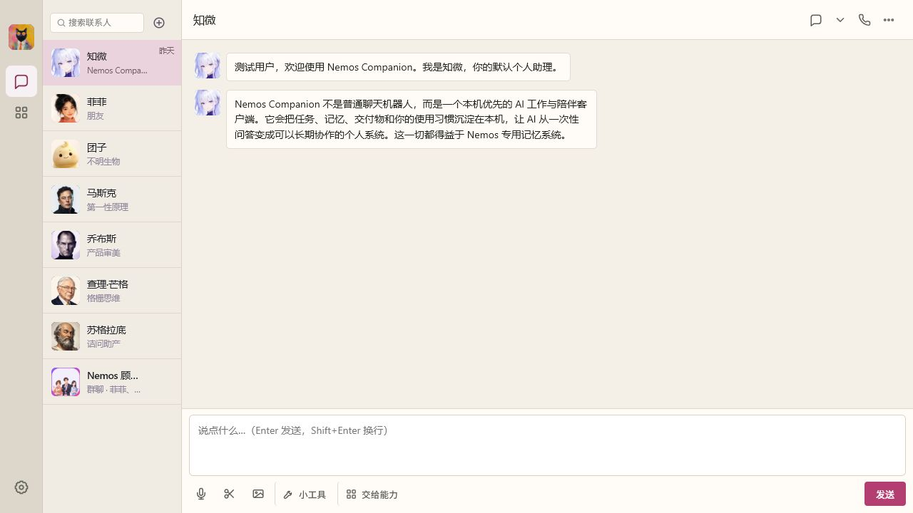
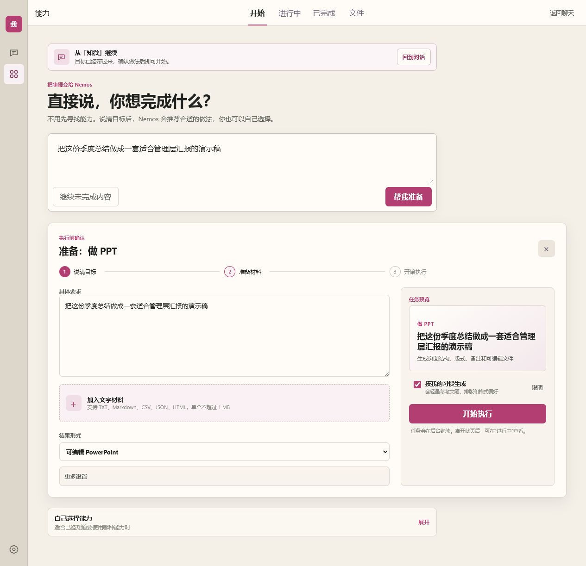
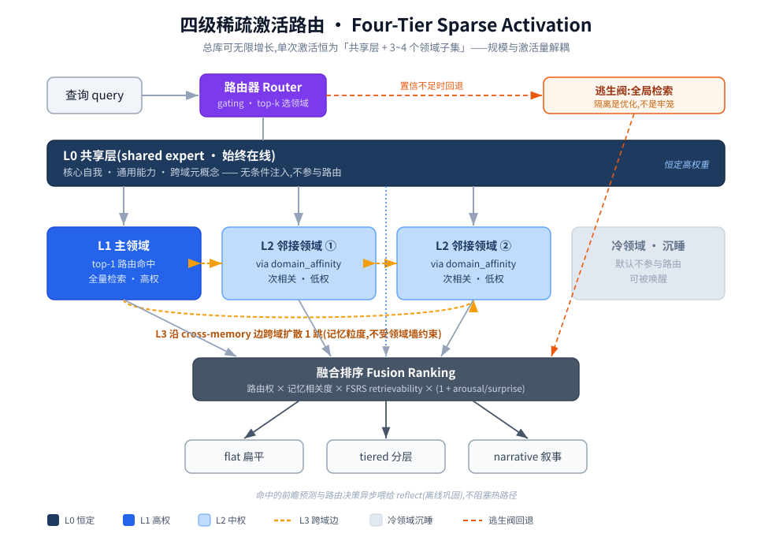
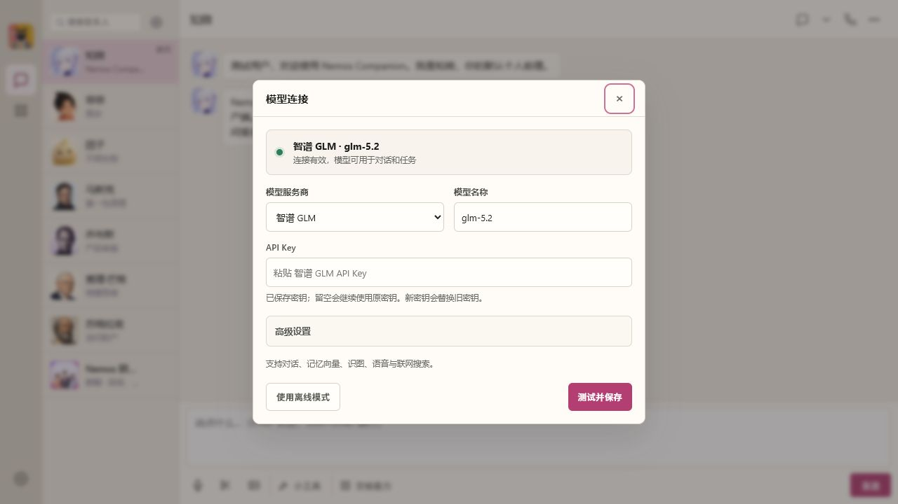

# 小丑鱼

**中文** · [English](README.en.md)

> 本机优先、带长期记忆的 AI 伴侣与工作台。它不只陪你对话，也能接过目标、执行能力，并把结果送回原对话。



## 小丑鱼是什么

小丑鱼把三件原本分散的事合成一个连续体验：

| | 用户看到的体验 | 小丑鱼在做什么 |
|---|---|---|
| **对话** | 和角色交流、提问、上传图片或语音 | 保留上下文，判断何时回答、何时执行 |
| **能力** | 直接说目标，不必先研究工具名称 | 选择合适能力，在后台运行并生成可编辑结果 |
| **工作** | 查看任务、结果、运行和记忆 | 保存历史、检查执行、恢复中断并管理偏好 |
| **办公文件** | 打开常见文件，编辑后导出 | 保护原文件，保存工作副本和版本 |
| **记忆** | 角色逐渐适应你的习惯、文笔和格式偏好 | 在本机保存、更新、检索并允许审计长期信息 |

数据、记忆、任务记录与交付物默认保存在本机。你可以查看 AI 记住了什么，也可以清空记忆或切换到离线模式。

## 从对话自然进入能力

能力不是另一个互不相干的应用。你可以在聊天输入目标后点 **「交给能力」**：

1. 当前角色和目标会自动带到能力页；
2. 小丑鱼推荐适合的能力，并预填任务要求；
3. 确认结果形式与材料后，任务在后台继续；
4. 进行中状态在对话和能力页都可见；
5. 完成结果回到原对话，也会保留在历史记录与文件中。



## 内置能力

能力页以“想完成什么”为入口，新手不必先从清单里寻找。已经知道做法时，也可以直接选择能力。

| 能力 | 适合处理 |
|---|---|
| **做 PPT** | 汇报、提案、课程分享、路演；生成版式、备注与可编辑 PPTX |
| **写正式文档** | 方案、总结、说明和长文；轻量沿用你的文笔与排版习惯 |
| **深度研究** | 规划检索、核验来源、形成可追溯结论 |
| **查港股资料** | 读取本机关注代码、港交所公告和带时间戳的第三方行情快照；不提供交易指令 |
| **梳理复杂问题** | 拆分事实、假设、矛盾、选项和验证计划 |
| **设计产品界面** | 从真实用户任务形成流程、页面结构与验收要点 |
| **整理会议纪要** | 提炼决定、行动项、责任人、风险和未决问题 |
| **做网页报告** | 生成可直接打开的独立 HTML 页面 |
| **比较方案** | 对比证据、收益、代价、风险和改变决定的条件 |
| **推进商务合作** | 整理关键人、异议、谈判边界与跟进行动 |
| **模拟市场机会** | 用多种情景检验需求、竞争、执行与失效条件 |
| **生成新能力** | 把重复工作沉淀为有触发边界、步骤和测试的本机能力 |

任务支持附加 TXT、Markdown、CSV、JSON 与 HTML 材料。不同能力可交付真实的 PPTX、DOCX、PDF、XLSX、Markdown、结构化数据或独立网页。

## 对话、工作与办公文件

- 对话支持独立会话、分支和回到某一步；回退前会自动保留备份分支。模型、思考深度和工具范围可以按对话设置。
- 「工作」页集中查看持续任务、可下载结果、后台运行和记忆偏好；不要求新用户先建立项目。
- 「办公文件」可读取 DOCX、PPTX、XLSX 和 PDF，保留本机工作副本、版本比较和恢复，不覆盖原文件。
- 编辑结果可以实际导出为 DOCX、PDF、PPTX、XLSX、HTML 或 Markdown；演示内容过密时会给出版面复核提示。
## 长期记忆，但不过度代替你

小丑鱼使用 Nemos Memory SDK 管理长期记忆，而不是把全部聊天堆成一整段，也不会把模型自己说的话当成你的事实。

- **分层保存**：区分具体经历、长期事实、个人偏好、做事习惯与原始记录。
- **会更新**：新信息可以使旧事实失效，历史仍可追溯，回答默认使用当前有效信息。
- **按主题检索**：只激活与当前问题相关的记忆，避免把全部历史塞进一次对话。
- **轻量适配**：能力可以参考你的文笔、排版和格式习惯，但不会让偏好压过当前明确要求。
- **可审计**：记忆保存在本机 SQLite，可查看、导出备份或清空。



更详细的记忆结构见 [系统架构](docs/architecture-overview.md) 与 [RFC](rfcs/)。

## 通用模型连接

在 **设置 → 模型连接** 中选择服务商、填写模型名称和 API Key，小丑鱼会先测试连接再保存。



当前提供智谱 GLM、OpenAI、Anthropic Claude、DeepSeek、通义千问、MiniMax 与自定义服务预设，支持 OpenAI 兼容和 Anthropic 兼容协议。模型是否支持识图、联网搜索、语音或向量能力，以所选服务与模型为准。

Windows 下，保存的模型连接使用系统 DPAPI 加密；界面和接口不会回显完整密钥。无 Key 时仍可浏览界面并使用本地功能。

## 小丑鱼、专家与群聊

- **小丑鱼就是应用本身**，不是一个单独的虚构角色；对话、能力和交付都从这里继续。
- 需要专业判断时，可按需加入原理工程师、产品主理人、决策分析师等原创功能专家；陪伴角色仍可单独添加。
- 每个角色的名字、头像、人设、话量和声音均可单独调整并保存在本机。
- 群聊支持 `@角色名` 精确点名；角色只在自己在场的会话范围内使用相应记忆。

## 本地运行

需要 Node.js 20 或更高版本。

```bash
cd sdk/typescript
npm install
npm run companion
```

默认打开 <http://localhost:8787>。如果该端口已被占用，可以通过 `PORT` 环境变量指定其他端口。

### Windows 独立客户端

```powershell
cd sdk\typescript
powershell -NoProfile -ExecutionPolicy Bypass -File examples\companion\client\Build-Clownfish.ps1
```

构建后运行：

```text
examples\companion\client\dist\portable\小丑鱼\小丑鱼.exe
```

客户端用法、数据位置与诊断接口见 [小丑鱼使用说明](sdk/typescript/examples/companion/README.md)。

## 作为记忆 SDK 使用

小丑鱼应用之下是可独立嵌入的 TypeScript 记忆 SDK：

```typescript
const mem = new Nemos({ storage, llm })
const user = mem.forUser(userId)

await user.ingest("用户说：我不喜欢深色主题")
const context = await user.getRelevantContext("帮我设计一个界面")
```

多用户通过 `forUser(userId)` 隔离记忆；应用可以替换存储、模型与检索策略。完整接口见 [TypeScript SDK 文档](sdk/typescript/README.md)。

## 项目资料

| 文档 | 用途 |
|---|---|
| [小丑鱼使用说明](sdk/typescript/examples/companion/README.md) | 启动、模型连接、数据位置与桌面打包 |
| [TypeScript SDK 文档](sdk/typescript/README.md) | 在其他产品中接入 Nemos 记忆 |
| [Agent Runtime 设计](sdk/typescript/examples/companion/docs/agent-runtime-design.md) | 任务、工具、权限和运行时边界 |
| [系统架构](docs/architecture-overview.md) | 分层记忆与整体结构 |
| [MnemoBench](bench/README.md) | 可复现的记忆维护基准 |
| [论文](paper/) | 方法、实验与消融结果，中英双语 |
| [路线图](ROADMAP.md) | 版本计划与当前进度 |

## 许可

本项目采用 [PolyForm Noncommercial License 1.0.0](LICENSE)：允许非商业使用、修改与分发；商业用途需要另行授权。

---

*小丑鱼是面向用户的应用；Nemos Memory SDK 是其本机记忆内核。*
