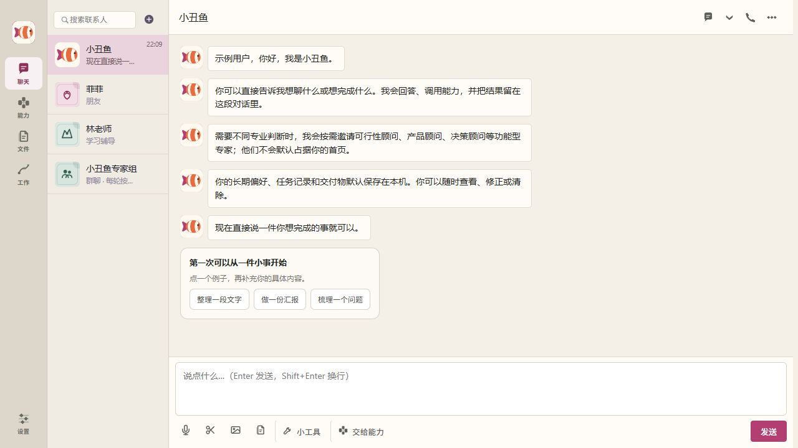
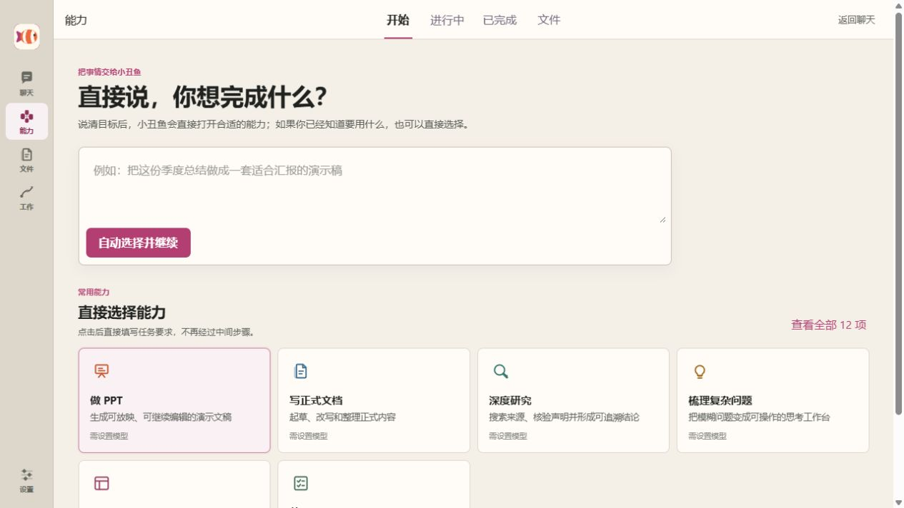
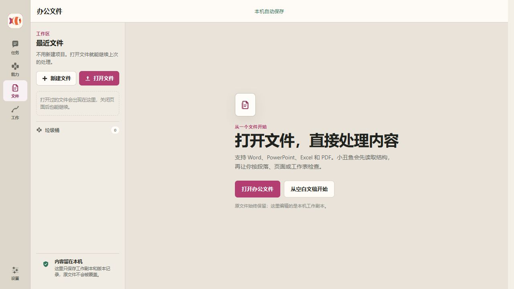
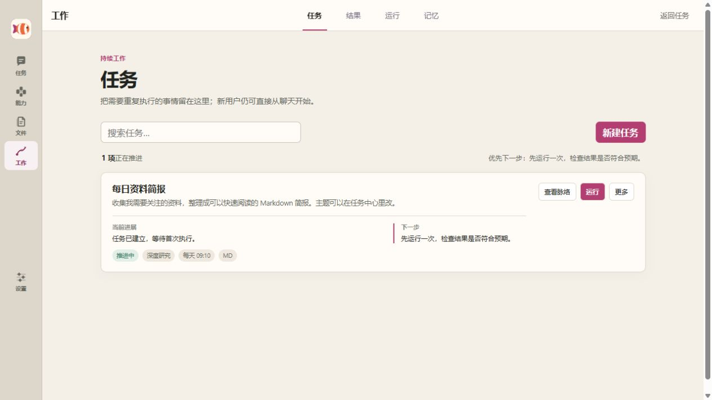
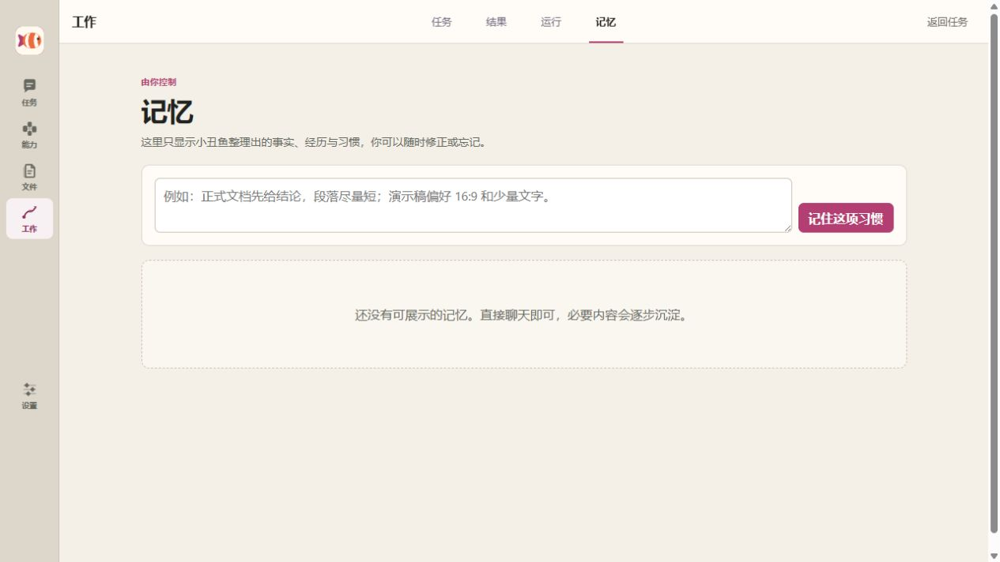
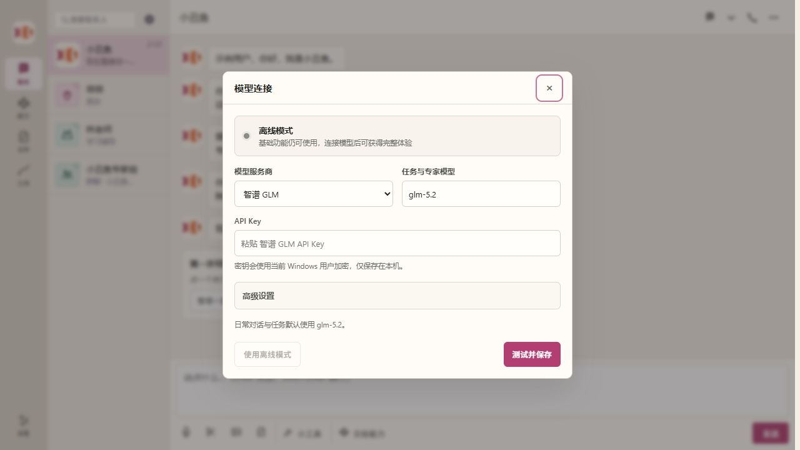

# 小丑鱼

**中文** · [English](README.en.md)

> 一款本机优先、带长期记忆的 AI 工作应用。从一条新对话开始，按需要完成任务或进入学习辅导；复杂工作可以继续交给能力、文件和工作中心。

## 现在能做什么

小丑鱼把四个常用入口放在同一套界面里：

| 入口 | 用户操作 | 当前实现 |
|---|---|---|
| **对话** | 直接新建、搜索、切换或删除独立对话，需要时切换为完成任务或学习辅导，并可上传图片或文件 | 内容自动命名、多任务并行、独立上下文、结果回到原对话 |
| **能力** | 直接描述目标，或直接选择一种能力 | 后台任务、实时进度、取消与重试、结果预览和下载 |
| **文件** | 打开 Word、PowerPoint、Excel 或 PDF | 保留原文件、编辑本机工作副本、页内处理和版本记录 |
| **工作** | 查看任务、结果、运行和记忆 | 计划任务、交付物、运行记录、习惯管理 |

新用户不需要先创建项目，也不需要先理解工具名称。

## 任务：入口简单，工作方式按目标切换

首页默认只保留一个清楚的一对一入口：

- **直接聊聊**适合问答、讨论、灵感和日常交流，默认使用更轻量的响应路径。
- **完成任务**围绕明确目标持续推进，后台按需调用专业判断和能力，并形成可继续处理的结果。
- **学习辅导**使用讲解、提问、练习和反馈帮助用户真正理解，不要求用户先认识或选择某位老师。

左侧采用常见工作应用的线程列表：产品名称位于图标下方，“新对话”固定在顶部，搜索按需展开。首次发送后，系统会用日常轻量模型在后台提炼简短标题；模型不可用时改用本地规则命名，不阻塞回复，也不把标题请求写进长期记忆。

不同任务可以并行运行，各自保留对话、文件、进度和结果。专家与教学人设仅作为内部执行方式，不占据首页，也不要求用户配置。任务转交能力时，会同时保留用户原文和提炼后的上下文，而不是只传递最后一句话。

## 能力：说目标，也可以直接选

能力页有两条同等有效的路径：

1. 写下要完成的事情，由小丑鱼选择合适能力；
2. 已经知道要做什么时，直接点击能力并填写要求。

选择后直接进入任务填写，不再增加“准备能力”之类的中间步骤。运行期间可以离开页面，进度和结果会保存在本机。

内置能力覆盖以下常见任务：

- 做 PPT
- 写正式文档
- 深度研究
- 查港股资料
- 梳理复杂问题
- 设计产品界面
- 开发项目
- 整理会议纪要
- 做网页报告
- 比较方案
- 推进商务合作
- 模拟市场机会
- 生成新能力

不同能力可以交付 PPTX、DOCX、PDF、XLSX、HTML、Markdown 或结构化数据。

## 文件：原文件、工作副本和结果不分家

文件页支持 DOCX、PPTX、XLSX 和 PDF：

- 新建文件和打开文件位于最近文件列表上方；
- 原文件保留在本机，不会被编辑流程覆盖；
- PDF 可显示原始版式，Office 文件提供结构化预览并保留原文件；
- 编辑、版本记录、AI 处理进度和结果都留在当前页面；
- 聊天或能力生成的结果可直接进入文件页，保存为本机工作副本继续编辑；
- 删除工作文件时先进入垃圾桶，可恢复，也可明确永久删除；
- 可以导出 DOCX、PDF、PPTX、XLSX、HTML 和 Markdown。

## 工作：持续任务和交付物集中管理

需要反复执行或在后台推进的事情会进入工作中心：

- **任务**保存目标、计划、当前进展和下一步；
- **结果**集中查看能力生成的文件和报告；
- **运行**保留每次执行的状态、日志和错误信息；
- **记忆**管理小丑鱼整理出的事实、经历与习惯。

新用户仍可直接从对话开始，不需要先理解“项目”或“工作流”。

## 记忆：少量、可见、由用户控制

小丑鱼使用同仓库的 Nemos Memory SDK 保存长期记忆。当前应用中的实际规则是：

- 用户内容与角色自身内容存放在不同命名空间，角色回复不会写入用户事实库；
- 原始对话进入受保护的归档层，分类记忆用于检索和长期适配；
- 普通对话按当前问题召回相关事实；
- 能力任务可以只召回交付偏好，从“习惯与做法”和“个人偏好”中最多选取 6 项；
- 任务记录会说明本次实际采用了哪些习惯，也可以对单次任务完全关闭习惯记忆；
- 用户可在工作页明确添加习惯，也可忘记单条分类记忆；
- 原始归档不会被“忘记”或“清理分类记忆”误删。

文笔、排版和格式偏好只作为补充，当前任务的明确要求始终优先。

记忆内核的结构、事实演化和召回接口见 [TypeScript SDK 文档](sdk/typescript/README.md) 与 [v0.7 实现设计](sdk/typescript/docs/nemos-memory-v0.7-design.md)。

## 通用模型连接

打开 **模型连接** 面板后，选择服务商、模型名称并填写 API Key。系统会先验证连接，再保存配置。

小丑鱼会按服务商预设分配模型：支持独立日常对话模型的服务会自动分流，专家、能力、文件生成和复杂任务使用这里配置的任务模型；没有独立分流时，两类任务使用同一个模型。

当前预设包括智谱 GLM、OpenAI、Anthropic Claude、DeepSeek、通义千问、MiniMax 和自定义服务，支持 OpenAI 兼容与 Anthropic 兼容协议。识图、联网和向量能力取决于所选服务与模型。

Windows 下，密钥使用当前用户的 DPAPI 加密并保存在本机；接口不会回显完整密钥。离线模式可以浏览界面、管理本机内容和使用不依赖模型的功能。

## 数据与隐私边界

- 新安装的记忆数据库、任务、运行记录、文件工作副本和交付物默认位于 **~/.clownfish**；检测到旧版 **~/.nemos-companion** 数据时会继续沿用，避免迁移时丢失内容。
- 调用已配置的模型时，当前请求及必要上下文会发送给该模型服务商；新对话首次发送后还会使用同一服务商的轻量模型生成短标题；打开联网来源时会访问相应公开服务。
- 本机日志和运行记录会脱敏常见凭证字段，但仍不应把密钥或私人配置写入任务正文。
- 导出或分享备份与便携包前，应确认其中不包含用户数据目录。

## 当前验证状态

- TypeScript 构建通过；
- 508 项自动化测试全部通过；
- 首页、能力、文件、工作、记忆和模型连接已用全新本机数据目录重新截图核对；
- 最近一次完整真实使用检查见 [2026-08-08 十轮检查报告](sdk/typescript/examples/companion/docs/reviews/2026-08-08-web-true-check-10-rounds.md)。

## 本地运行

需要 Node.js 22.19 或更高版本。

~~~powershell
cd sdk\typescript
npm install
npm run companion
~~~

默认地址是 <http://localhost:8787>。可用 **PORT** 修改端口，用 **CLOWNFISH_HOME** 修改数据目录。

### Windows 便携客户端

~~~powershell
cd sdk\typescript
powershell -NoProfile -ExecutionPolicy Bypass -File examples\companion\client\Build-Clownfish.ps1
~~~

构建脚本会下载并校验 WebView2、沙箱 Node 和 Python 运行时。输出目录：

~~~text
examples\companion\client\dist\portable\小丑鱼
~~~

## 作为记忆 SDK 使用

~~~typescript
import { Nemos } from "@nemos/sdk";

const nemos = new Nemos({
  storage: { type: "sqlite", path: "./memory.db" },
  llm,
});

const memory = nemos.forUser(authenticatedUserId);
await memory.ingest("用户说：正式文档先给结论");
const context = await memory.getRelevantContext("起草一份方案");
~~~

**userId** 应来自服务端可信身份，不能直接相信客户端传入值。

## 文档入口

| 文档 | 内容 |
|---|---|
| [小丑鱼使用说明](sdk/typescript/examples/companion/README.md) | 启动、数据目录、桌面构建和接口 |
| [TypeScript SDK](sdk/typescript/README.md) | 当前可用的记忆 API |
| [记忆架构](docs/architecture-overview.md) | 已实现结构与边界 |
| [运行架构](sdk/typescript/examples/companion/docs/agent-runtime-design.md) | 任务、工具、权限与恢复 |
| [产品方向](sdk/typescript/examples/companion/docs/clownfish-product-direction.md) | 目标用户、核心工作链路与开发优先级 |
| [路线图](ROADMAP.md) | 当前版本和后续重点 |
| [文档导航](docs/README.md) | 使用、集成、架构与研究资料入口 |

## 许可

本项目采用 [PolyForm Noncommercial License 1.0.0](LICENSE)。允许非商业使用、修改和分发；商业用途需要另行授权。
