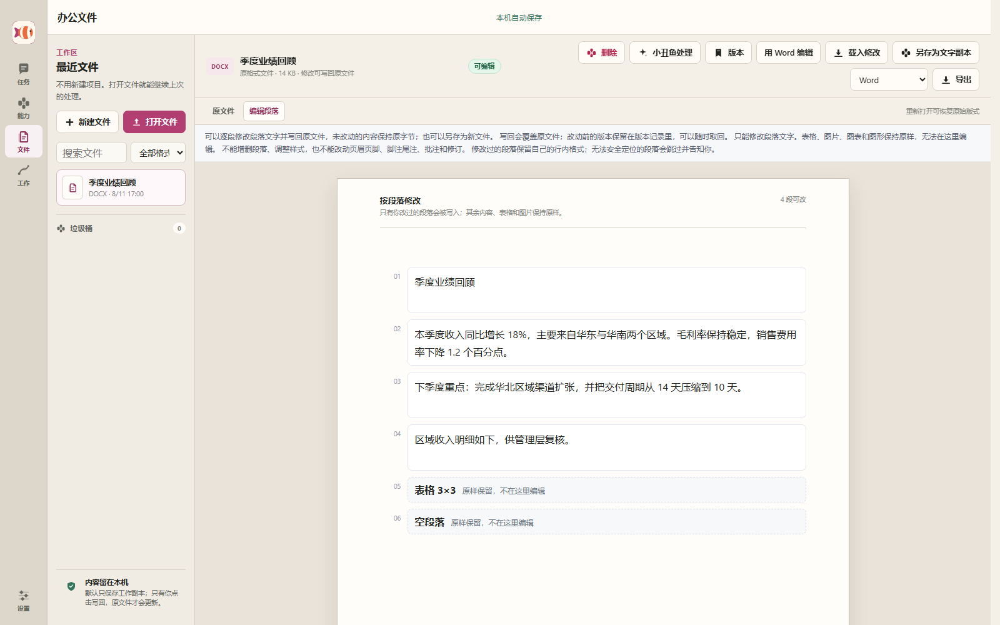

# 小丑鱼（Clownfish）

**中文** · [English](README.en.md)

[](https://github.com/mmlong818/nemos/actions/workflows/ci.yml)
[](LICENSE)
[](#本地运行)

小丑鱼是一款**本机优先、带长期记忆的 AI 工作应用**。用户可以从一句话开始，继续完成任务、处理文件、组织长期工作；不需要先创建项目、挑选专家或理解工具名称。


## 产品结构

| 入口 | 适合做什么 | 主要结果 |
| --- | --- | --- |
| **对话** | 问答、讨论、完成任务、学习辅导 | 独立对话、自动标题、附件与结果回传 |
| **能力** | 研究、文档、演示、分析、设计、开发等专门任务 | 后台执行、进度、重试、可下载产物 |
| **文件** | 打开、转换、编辑和导出常见办公文件 | 可编辑工作副本、原文件、版本与导出文件 |
| **开发** | 在授权的本地项目中实现、修复或审查代码 | 文件改动、依赖安装回执、检查结果与可恢复记录 |
| **工作** | 管理多个任务、资料、自动化、运行和记忆 | 持续任务、工作空间、审阅记录与交付物 |
| **设置** | 配置模型、开发方式、数据连接和保存位置 | 连接状态、加密凭证、本地或自托管保存方式 |

这些入口共享同一份任务上下文和产物，不会把聊天、文件与能力结果割裂成互不相关的副本。

## 对话与任务

每次新对话可以选择三种工作方式：

- **直接聊聊**：日常问答、讨论和灵感；
- **完成任务**：围绕明确目标持续推进，按需调用能力与专家判断；
- **学习辅导**：通过讲解、提问、练习和反馈帮助用户理解。

每条对话独立保存上下文和草稿，首次发送后自动生成简短标题。不同任务可以并行运行。专家和教学人设属于内部执行方式，不要求用户配置，也不会挤占首页。

把对话交给能力时，小丑鱼会同时传递**完整原文、上下文提要、附件和已有决定**，而不是只转交最后一句话。

## 能力

用户既可以直接描述目标，让小丑鱼自动选择能力，也可以从能力页直接选择。选中后立即填写要求并启动，不经过额外的“准备能力”步骤。

当前内置能力覆盖：

- 研究与资料核验；
- 正式文档、会议纪要、网页报告和演示文稿；
- 复杂问题梳理、方案比较和市场分析；
- 产品界面设计、商务推进与项目开发；
- 翻译、语音转写和文字润色；
- 创建可复用的新能力。

任务在后台持续执行，保留检查点、取消、失败原因、重试入口和最终产物。运行完成与结果送达分别记录；页面刷新或应用重启后，未确认送达的结果会继续投递，失败不会伪装成任务已完成。一个能力的结果可以继续交给另一个能力，仍沿用同一任务脉络。

“开发项目”使用独立工作台：选择目录后用普通语言描述结果，小丑鱼会查看项目、修改代码并运行检查。默认使用 Pi Agent，也可在任务开始前切换 DeepSeek Harness、Kilo Code、OpenCode 或 Codex；五种引擎都接入同一套项目隔离、检查和待确认提案流程，不会直接覆盖原项目。Codex 使用 Responses API 兼容连接，其余引擎同时支持当前的 OpenAI 兼容与 Anthropic 连接。缺少依赖时，可按项目锁文件安装到项目目录或 Python 虚拟环境；不会进行全局安装，也不会执行模型临时编造的安装命令。修改受授权目录限制，项目在执行期间发生变化时会停止覆盖。

“设计产品界面”的结果不是一篇静态说明：结果页提供可编辑画布，可调整界面文案、内容区、状态、配色和桌面／平板／手机预览，并把修改保存为本机版本。


## 文件工作台

文件工作台处理 Word、PowerPoint、Excel、PDF、OpenDocument、RTF、EPUB、CSV、TXT 和 Markdown 等常见格式。

基本原则是：**保留原文件，在可编辑副本中工作，导出时生成新文件。**

- TXT 和 Markdown 可以在明确授权后写回原文件；其他导入格式默认不改写原件；
- Word、PDF 等文字文档转换为包含标题、段落、列表、表格、引用和代码的结构化副本；
- 演示文稿与电子表格使用各自的结构模型，不强行压成普通聊天文本；
- 转换页面会列出实际保留内容和已知变化；需要原版式时可以查看或下载原文件；
- 多窗口编辑使用版本检查，旧页面不能覆盖较新的保存；
- 删除的工作文件先进入垃圾桶，可以恢复；
- 结果可以导出为 DOCX、PDF、PPTX、XLSX、HTML 或 Markdown。

复杂浮动对象、批注、跨节页眉页脚、公式、图表、演示母版和电子表格公式仍由原文件或桌面 Office/WPS 保真承接。小丑鱼不会把结构化副本宣传成无损原位编辑。



## 工作中心

工作中心把持续任务和交付物集中在一起：

- **任务**：目标、当前进展、下一步和关键决定；
- **空间**：组织同一件事下的多个任务与结果，可归档恢复；
- **自动化**：每日或按使用频率执行，可暂停、编辑和立即运行；
- **协作**：小丑鱼根据任务动态调用专家，最终仍由小丑鱼统一交付；
- **资料**：保存本地笔记、文本与链接，只在明确选中时进入任务上下文；
- **结果**：集中查看能力生成的文件和报告；
- **运行**：查看状态、检查点、错误、审阅队列和真实检查记录；
- **记忆**：管理事实、经历和少量高价值习惯。

资料页同时展示六类连接器的真实状态：**本地文件、浏览器、GitHub、邮箱、日历、企业文档**。本地文件与受支持的浏览器能力可以内置使用；其余连接器只有安装并通过测试后才显示可用。

扩展支持权限预览、安装、启用、更新、恢复上一版、停用和卸载。涉及本机执行、网络、文件写入或权限扩大的变更需要再次确认。
扩展可以明确声明破坏性操作；这类操作一旦失败，本次运行会停止后续同类调用，并把熔断状态保留到恢复检查点。


## 记忆与隐私

记忆内核由独立依赖 [`@nemos/sdk`](https://github.com/mmlong818/nemos-memory) 提供，本仓库不维护它的重复副本。

- 用户事实与角色自身内容分开保存，避免身份互换；
- 普通对话只召回当前问题需要的内容；
- 能力任务可以只采用文笔、排版、格式等交付偏好，也可以单次关闭习惯记忆；
- 任务结果会说明本次实际采用了哪些偏好；
- 用户可以查看、添加或忘记分类记忆，界面不展示内部原始归档。

当前任务的明确要求始终高于历史偏好。

默认数据目录为 `~/.clownfish`。调用已配置的模型时，当前请求与必要上下文会发送给对应服务商；本地日志会脱敏常见凭证字段，但任务正文仍不应包含密钥。

Windows 下，模型密钥使用当前用户的 DPAPI 加密，接口不会回显完整密钥。

### 数据保存

默认使用纯本地模式，数据不上传到小丑鱼服务器。需要多设备或服务器备份时，可在 **设置 → 数据保存** 中连接自己部署的 Docker 同步服务：客户端会先用同步口令进行端到端加密，服务器只保存密文快照。同步令牌与口令使用 Windows DPAPI 保存在本机，不会进入同步快照。

本机 Docker 可以使用 `http://127.0.0.1:8799`；远程部署必须放在 HTTPS 反向代理之后。启动示例：

```powershell
$env:CLOWNFISH_SYNC_TOKEN="请替换为至少24位的随机令牌"
docker compose up -d --build
```

服务器模式仍然以本机数据为工作副本，断网不会阻止日常使用。恢复操作先下载并校验快照，在重启小丑鱼后生效。

## 模型连接

在应用中打开 **设置 → 模型与服务**，选择服务商与模型并填写 API Key。连接验证通过后才会保存。

当前支持智谱 GLM、OpenAI、Anthropic Claude、DeepSeek、通义千问、MiniMax 和自定义服务，并兼容 OpenAI 与 Anthropic 协议。识图、联网搜索和向量能力取决于所选服务与模型。

日常对话优先使用服务商提供的轻量模型；专家、能力、文件生成和复杂任务使用任务模型。没有独立分流时，两类请求使用同一配置。

## 已验证状态

截至 2026-08-15：

- 构建、类型检查和 **417 项自动化测试**全部通过；
- **20/20** 份脱敏 DOCX 通过结构往返，并由本机 Microsoft Word 打开；
- **10/10** 类小项目通过检查、修改提案、选择性写入和回滚；
- 本轮新增 **10 轮真实使用检查**并保存在“工作 → 运行”中；累计记录 30 轮，当前 0 个未修问题；
- Docker 同步完成健康检查、鉴权、加密上传、下载和重启恢复；受控依赖安装完成真实 npm 锁定安装验证；
- 离线依赖审计未发现已知漏洞，敏感信息扫描未发现密钥。

详细证据见[产品能力验收记录](docs/product-capability-acceptance-2026-08-13.md)和[已接入机制逐项证据](docs/integration-capability-evidence-2026-08-15.md)。记忆内核测试由 `nemos-memory` 仓库独立维护，不在上述 417 项中重复计算。

## 本地运行

需要 Node.js 22.19 或更高版本。

```powershell
cd sdk\typescript
npm install
npm run companion
```

打开 <http://localhost:8787>。可用 `PORT` 修改端口，用 `CLOWNFISH_HOME` 修改数据目录。

### Windows 便携客户端

```powershell
cd sdk\typescript
powershell -NoProfile -ExecutionPolicy Bypass -File examples\companion\client\Build-Clownfish.ps1
```

输出目录：`examples\companion\client\dist\portable\小丑鱼`。

## 使用记忆内核

记忆 API 来自独立维护的 `@nemos/sdk`。本仓库在其上提供 Agent 运行时和小丑鱼应用。

```typescript
import { Nemos } from "@nemos/sdk";

const nemos = new Nemos({
  storage: { type: "sqlite", path: "./memory.db" },
  llm,
});

const memory = nemos.forUser(authenticatedUserId);
await memory.ingest("用户说：正式文档先给结论");
const context = await memory.getRelevantContext("起草一份方案");
```

`userId` 必须来自服务端可信身份，不能直接相信客户端参数。

## 文档

| 文档 | 用途 |
| --- | --- |
| [小丑鱼使用说明](sdk/typescript/examples/companion/README.md) | 启动、数据目录、桌面构建和接口 |
| [TypeScript 接入层](sdk/typescript/README.md) | Agent 运行时导出与记忆 API |
| [记忆架构](docs/architecture-overview.md) | 已实现结构与边界 |
| [Agent 运行架构](sdk/typescript/examples/companion/docs/agent-runtime-design.md) | 任务、工具、权限与恢复 |
| [路线图](ROADMAP.md) | 当前版本与后续重点 |
| [文档导航](docs/README.md) | 全部公开文档入口 |
| [安全策略](SECURITY.md) | 漏洞报告方式 |

## 授权

本仓库采用双授权结构，以 [LICENSING.md](LICENSING.md) 为准：

- TypeScript 接入层、Agent 运行时与公开研究资料采用 [PolyForm Noncommercial 1.0.0](LICENSE)，商业用途需另行授权；
- 独立记忆内核 `@nemos/sdk` 以其仓库随附许可证为准；
- 小丑鱼应用 `sdk/typescript/examples/companion/` 保留全部权利，见其[单独声明](sdk/typescript/examples/companion/LICENSE)。
