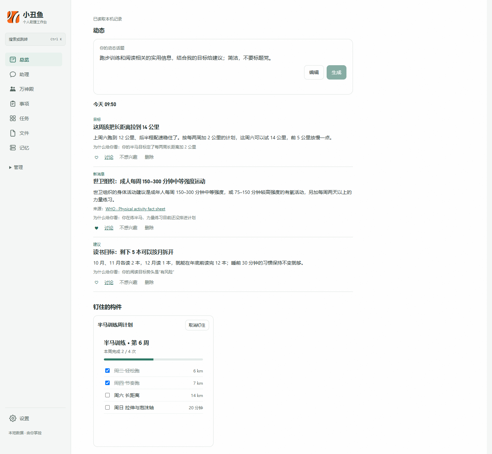
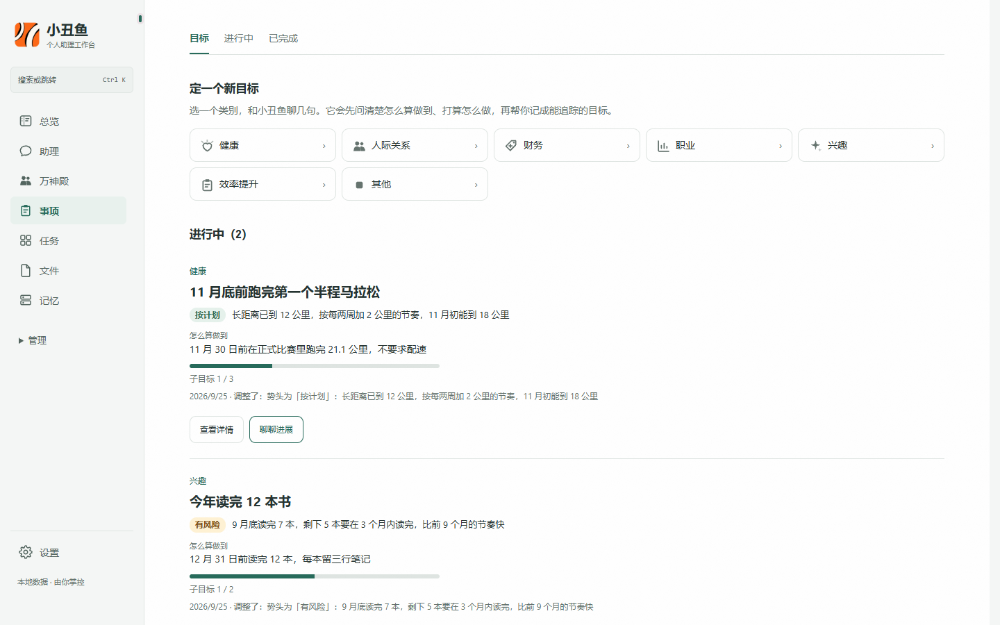
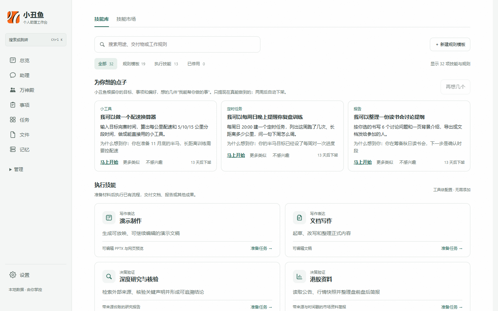
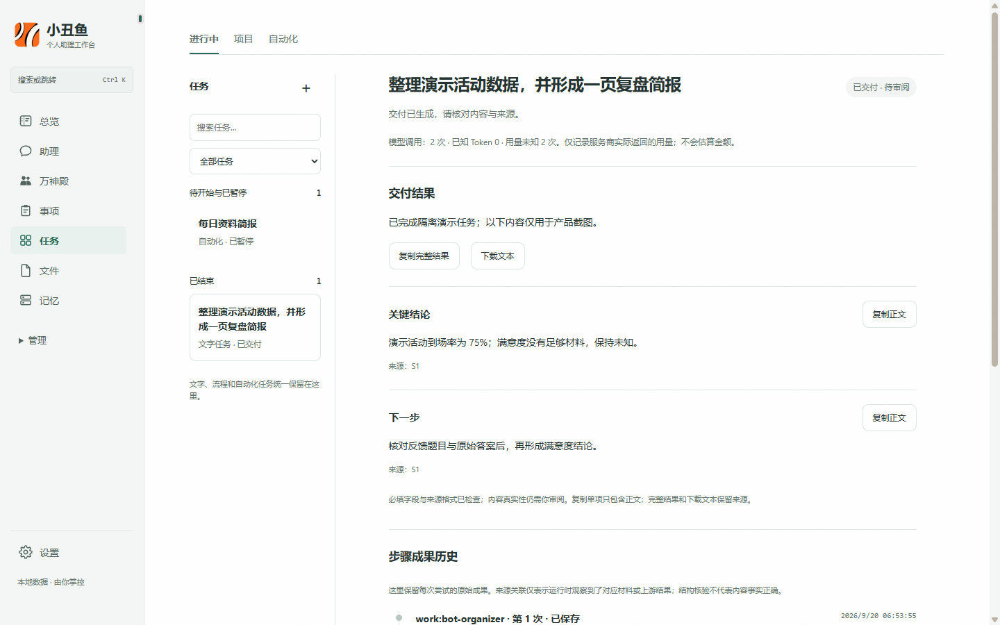
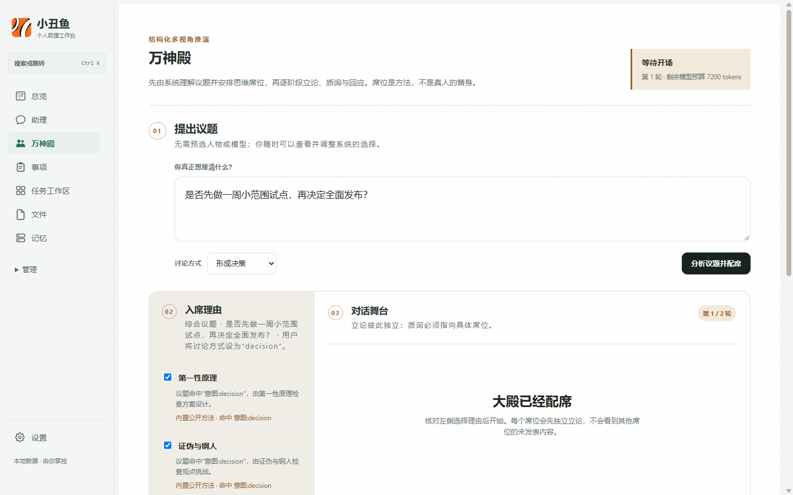
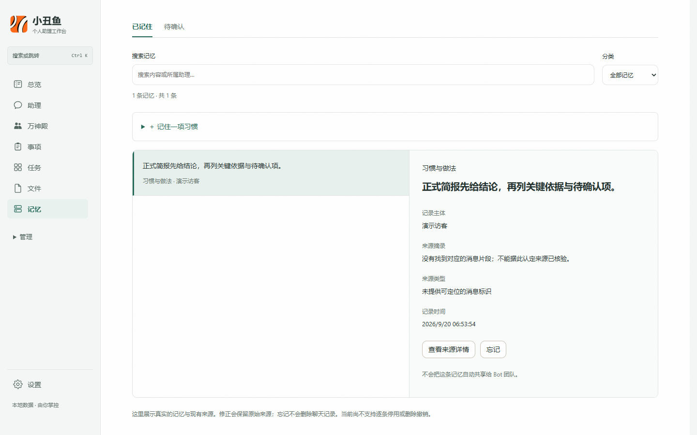
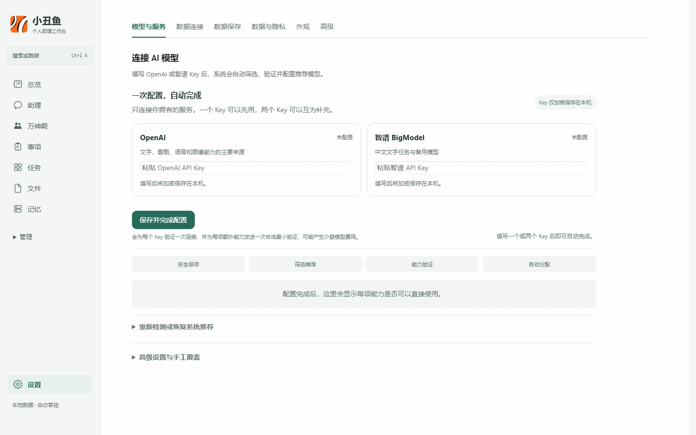

# 小丑鱼（Clownfish）

> 本机优先的个人 AI 助理：同一个有性格的助手陪你聊天、替你办事、帮你盯着在意的事；目标、事项、任务、文件、成果与长期记忆都放在同一个可追踪、可审计的本机工作空间。

**中文** · [English](README.en.md)

[](https://github.com/mmlong818/nemos/actions/workflows/ci.yml)
[](https://github.com/mmlong818/nemos/tree/v0.7.6)
[](#安装与启动)
[](#当前边界)
[](LICENSE)

> [!IMPORTANT]
> 本仓库是 **source-available（源码可见）项目，不是 OSI 认证的开源软件**。当前版本只允许个人、教育和非营利研究用途；禁止直接或间接商业使用，包括付费服务、企业内部业务运营、商业产品集成、转售、SaaS / 托管、商业训练及其他营利活动。商业授权必须取得版权所有者的单独书面许可。完整条款以 [LICENSE](LICENSE) 为准，第三方组件仍适用各自的许可证。



_真实当前界面，使用隔离的合成演示数据；不含用户资料或真实服务凭据。_

## 产品概览

小丑鱼不是只回答一轮问题的聊天窗口。它是一个会记事、会跟进、会主动开口的个人助理，同时把每一步都留在本机、可以核对：

**和助理聊清楚 → 定成目标、事项或任务 → 助理动手（写页面、做小工具、建提醒、交办任务） → 留下状态、回执和自测结果 → 到点主动提醒或在有新变化时告诉你 → 由你决定哪些内容进入长期记忆**

应用当前包含这些彼此衔接的区域：

- **助理**：小丑鱼是同一个有性格的助手，聊天和办事用同一种口吻；名字、说话方式和人设可以改。需要你选择时，回复末尾会给出可以直接点的快捷回复。菲菲、林老师、阿哲和灵灵覆盖生活交流、学习辅导、决策推进与轻量陪伴；需要专业视角时可按当前问题动态邀请专家。助理页右侧的活动栏实时显示它在做什么、等你批准什么、接下来排了什么。
- **目标**：选一个类别，先在聊天里聊清楚“怎么算做到”和节奏，再经你批准记下；目标有子目标、按日期分组的时间线、势头判断（按计划 / 有风险 / 落后，附依据），可以设定期对进度，每个目标固定一条聊天线程。
- **事项与任务**：事项保存持续推进的事和下一步；任务承接一次具体执行，记录附件、排队、运行状态、检查点、失败原因与交付回执。
- **动态**：按你写的话题，结合目标、事项和偏好，联网找几条值得看的写成简报；新消息必须带真实来源，没有值得写的就不硬凑。会从你的“喜欢”“不感兴趣”里学口味。
- **点子**：小丑鱼根据你的情况主动想几件“我能帮你做的事”，写明交付什么、为什么想到你；点“马上开始”就在聊天里动手。
- **构件**：在聊天里说“做一个能勾选的清单”“弄个番茄钟”，助理会做出可交互、带状态的小工具，直接嵌在回复里使用，交付前在浏览器里自测一遍；可以钉到总览。
- **帮我盯着**：写下几件在意的事，隔一段时间联网看一眼，只有出现新变化时才在聊天里告诉你并附来源。
- **技能库**：保存可检查、可编辑、可复用的工作方法。内置模板与用户修改分开管理。
- **万神殿**：围绕一个议题自动选择 1–3 种互补思维方法，分阶段立论、定向质询、回应和总结；席位选择、调用预算和用户插话均可审计。席位代表方法，不冒充真实人物。
- **记忆**：区分已经记住的内容和待确认的学习提议。用户可以查看来源、确认、修正或忘记，当前要求始终高于历史偏好。
- **文件与成果**：保留原文件，以工作副本编辑，并把导出内容登记为新成果；参考资料、生成成果和运行记录可以相互关联。
- **自动化、提醒与后台**：重复任务可以暂停、编辑或立即运行；可设免打扰时段和“想听 / 别提”的话题偏好；Windows 桌面版可开机在托盘里自动启动，关窗后提醒和定时任务照常工作。

## 当前工作流

### 助理：同一个你，聊天和办事

小丑鱼的人设是一份可编辑的设定：改名字只改它怎么自称，“小丑鱼”仍是应用名。聊天和办事共用同一段说话方式；办事时直接交付结果，不说“晚点发你”这类拖延承诺，缺信息就说清缺口。需要你做选择时，回复末尾会出现 2–4 个快捷回复按钮，点一下就发出。

助理页右侧的活动栏有四个页签：**动态**（后台任务的结果，只取记录的状态，不用模型写的摘要）、**批准**（待审批操作，可允许一次或本会话内放行）、**即将到来**（定时任务与目标对进度的下次时间）、**身份**（助手设定、记忆与工作准则入口）。

### 目标：先聊清楚，再追踪

在“事项 → 目标”选一个类别（健康、人际关系、财务、职业、兴趣、效率提升、其他），小丑鱼会先问清要做到什么、怎么算做到、打算怎么做，每次最多问两个问题；谈妥后弹出审批卡，你允许了才记下。目标包含：

- 口径、计划、期限和 2–4 个子目标；
- 按日期分组的时间线，每条注明是你操作的还是小丑鱼在对话里按你说的记下的，只记实际发生的事；
- 势头：小丑鱼记进展时对照期限和计划判断按计划、有风险或落后，并写明依据，判断不了就不填；
- 定期对进度：每天、每周、每两周或每月，到点小丑鱼在聊天里问一句；
- 固定的聊天线程：再点“聊聊进展”或对进度提醒，都会回到同一条对话；
- 相关点子：和这个目标有关的点子会列在目标详情里。



_势头标签旁写明判断依据；图中两个目标是专为截图创建的合成示例。_

### 动态、点子与帮我盯着

**动态**在总览页顶部。你写一段话题，点“生成”（或设成每天定时生成），小丑鱼先定几个搜索词联网搜索，再只根据搜到的来源和本机的目标、事项、偏好写最多 5 条。每条注明“为什么给你看”；新消息必须引用这次真的搜到的来源，引用不到就丢掉。你可以点喜欢、不感兴趣（带理由）、删除或“讨论”——讨论会带着这条内容开一段新对话。口味只从这些明确动作里学，看过不算。话题真的改了会立刻出一批。

**点子**在技能库顶部。点“想几个”，小丑鱼根据你的目标、事项和偏好想几件现在真能做到的事（小工具、定时任务、目标、报告或规则），写明怎么做、为什么想到你；“马上开始”以你的口吻发出准备好的第一句话，由小丑鱼在聊天里动手。可以点“更多类似”或“不感兴趣”，卡片两周后自动下架。



_每张点子写明交付类型和依据；依据只能来自目标、事项和偏好。_

**帮我盯着**在“设置 → 提醒与后台”。一行写一件在意的事（最多 5 件），设定间隔（1–24 小时）；到点每件事联网搜一次，由模型对照上次看到的情况判断有没有新变化——和上次一样就不出声，真有变化才在聊天里说一句并附来源。每天最多检查 48 次；没有配置联网搜索时不会运行，不用模型的记忆冒充查过了。

“想听 / 别提”写在同一页：写动态、想点子之前都会先读，“别提”里的话题不会出现。

### 构件：做出来就能用

在聊天里说“做一个能勾选的冰岛行李清单”“弄个番茄钟”“给我一个房贷计算器”，小丑鱼会写一个单文件、不联网的交互页面，直接嵌在回复里使用：

- 勾选、输入等状态保存在本机，刷新或换到总览仍是同一份；
- 交付前用本机的 Edge / Chrome 按实际使用的方式打开、断网、点一遍控件，记下脚本报错和想加载的外部资源，把结论写进回复；本机没有浏览器时如实写“没做自测”，页面没写完会判为不通过；
- 可以“钉到总览”，在总览页直接使用。

### 任务与技能

助理提供直接聊聊、完成任务和学习辅导三种工作方式。任务可以附加材料、指定模型，或让系统从已启用技能中自动选择工作方法。选择文件只会把原件登记到任务中；真正开始处理后，应用才按当前目标读取必要内容。

任务状态会区分完成、等待补充、受阻、取消和“外部写操作结果不确定”。空输出不会被标成成功，运行完成与结果送达也分别保存。协作任务可在阶段边界追加说明；进入最终汇总后，系统会拒绝无法诚实纳入的修改。



_任务工作区把合成任务、最终交付、来源与步骤回执放在同一处。_

技能是本地工作规则，不是另一种模型，也不会自动下载第三方脚本或同步第三方私人记忆。

### 万神殿

万神殿用于结构化多视角推演。系统先识别探索、挑战、决策或直接回答等意图，再公开选席理由和限制。每轮包含独立立论、交叉质询、回应和主持总结；只有用户明确要求收束时才生成最终结论。



_席位代表思维方法；图中议题是专为截图创建的合成示例。_

思维库可以根据用户有权使用的材料生成待审阅草案。没有材料时只建立用户定义的框架，不补写人物事实；草案经用户确认后才参与自动选席。会话当前暂存于运行进程，已确认的私有思维单元保存在本机。

### 文件与成果

文件工作台遵循“保留原件、编辑副本、导出新文件”的边界：

- 可读取 DOCX、PPTX、XLSX、PDF、ODT / ODS / ODP、RTF、EPUB、CSV、TXT 和 Markdown；
- 可导出 DOCX、PDF、PPTX、XLSX、HTML 和 Markdown；
- TXT 与 Markdown 只有在明确授权并通过冲突检查后才可写回；其他格式不覆盖原件；
- 版本、恢复、垃圾桶、下载与系统应用打开均保留独立记录；
- 复杂浮动对象、公式、图表、批注、演示母版、宏等不承诺无损转换，应以原文件及桌面 Office / WPS 为准。

能力中心当前提供 17 条面向用户的工作流，覆盖研究核验、正式文档、演示、会议纪要、翻译、转写、润色、网页报告、产品设计、决策与业务分析等场景。安装、依赖齐备、外部服务已配置和真实验证是不同状态；界面会分别显示，不把“可安装”冒充为“已经可用”。

### 记忆与自动化

长期记忆把用户事实、助理自身内容、任务线程和专家上下文分开保存。待确认的学习提议必须由用户明确同意后才会进入长期记忆；普通任务只召回当前目标需要的少量内容。记忆内核来自独立依赖 [`@nemos/sdk`](https://github.com/mmlong818/nemos-memory)。



_已记住与待确认分开呈现；每条内容保留主体、来源和修正或忘记入口。_

自动化用于重复任务的本机调度，支持暂停、编辑和立即运行，并保留任务与成果记录。实时外部结果仍取决于相应工具、连接和权限是否已经实际接通。

## 一次配置 OpenAI 与智谱

普通设置流程只需要填写 **OpenAI** 和 / 或 **智谱 BigModel** API Key：一个 Key 可以独立使用，两个 Key 可以互补。提交后系统依次完成：



_截图中的两个 Key 输入框均为空；应用不会在此页面回显已经保存的完整密钥。_

1. 使用 Windows 当前用户的 DPAPI 加密保存凭据；
2. 读取服务商目录或官方候选并筛选推荐模型；
3. 为每个 Key 执行一次最小连接验证，为额外能力各执行至多一次合成验证；
4. 启用通过验证的模型，并为不同能力设置默认分配；
5. 显示完整成功、部分成功或失败原因，保留已健康的手工设置。

验证会发起真实请求，可能产生少量模型费用。密钥不会由接口完整回显。高级设置仍保留其他厂商、兼容协议、自定义地址、完整目录和手工覆盖，但它们不属于普通用户的双 Key 主流程。

两个服务各自承担的能力：

| 服务 | 能力 |
| --- | --- |
| OpenAI | 文字、看图、语音识别、语音合成、图像生成；实际可用性取决于账号、型号、权限与验证结果 |
| 智谱 BigModel | 文字任务与联网搜索 |

## 数据、隐私与安全

- 网页服务默认只监听 `127.0.0.1`，用户数据默认位于 `~/.clownfish`；
- Windows 下模型密钥与工具凭据由当前用户的 DPAPI 加密，日志会对常见凭据字段脱敏；
- 浏览页面不会把任务、附件或记忆自动发送给模型；只有实际执行相关任务、点击“生成”“想几个”“现在看一次”，或你主动开启的定时生成与盯梢到点时，必要材料才会发送到用户配置的服务；
- 助理写入目标、事项等本机记录前会弹出审批卡，写明要记下什么；
- 模型生成的 HTML 产物与构件在无来源沙箱中打开：可以运行自身脚本，但拿不到应用的身份、不能调用应用接口，也不能向外发请求；
- 工具受权限、网络和运行审计约束；需要启动本机进程或访问外部服务时，界面会显示相应边界；
- 可选同步服务只保存客户端 AES-256-GCM 加密后的快照，本机仍是工作副本；远程部署必须使用 HTTPS；
- 用户不应把 API Key、密码或私人令牌写进任务正文、附件或项目文件。

隐私、导出与删除规则见 [PRIVACY.md](PRIVACY.md)，安全问题请按 [SECURITY.md](SECURITY.md) 私密报告。

## 安装与启动

需要 **Node.js ≥ 22.19**。Windows 是主要验证平台；Linux 和 macOS 可以运行网页服务，但当前模型密钥持久化依赖 Windows DPAPI，非 Windows 平台不能保存密钥，详见[已知限制](docs/model-key-storage-non-windows.md)。

```powershell
git clone https://github.com/mmlong818/nemos.git
cd nemos\sdk\typescript
npm install
npm run companion
```

打开 <http://127.0.0.1:8787>，进入 **设置 → 模型与服务** 完成连接。没有配置模型时仍可浏览本机数据，但不会发起模型任务。

| 环境变量 | 作用 | 默认值 |
| --- | --- | --- |
| `PORT` | 网页服务端口 | `8787` |
| `CLOWNFISH_HOME` | 用户数据目录 | `~/.clownfish` |
| `COMPANION_USER` | 本机用户命名空间 | `local-user` |
| `CLOWNFISH_SYNC_TOKEN` | 可选自托管同步令牌 | 未设置 |

### Windows 便携客户端

```powershell
cd sdk\typescript
powershell -NoProfile -ExecutionPolicy Bypass -File examples\companion\client\Build-Clownfish.ps1
```

完整解压生成的 portable ZIP 后，启动 `portable\小丑鱼\小丑鱼.exe`。便携包包含桌面外壳与所需运行时，但模型配置和用户数据仍保存在本机用户目录；分发前应确认没有误带任何用户数据。

关闭窗口可以缩到托盘继续运行；在托盘图标的右键菜单里勾选“开机自动启动”后，开机时小丑鱼直接在托盘里运行、不弹窗口。托盘通知会写明是事项跟进、目标对进度还是盯着的事有新情况，免打扰时段内不弹。

### 可选自托管同步

```powershell
$env:CLOWNFISH_SYNC_TOKEN="请替换为至少24位随机令牌"
docker compose up -d --build
```

本机可使用回环地址；远程同步服务必须置于 HTTPS 后面。

## 当前边界

- 产品处于 **Alpha**，数据结构、界面和公开 API 仍可能变化；
- 界面目前主要为中文，桌面能力主要在 Windows 验证；
- 自动化验收使用伪服务，不使用真实用户 Key，也不代表每个外部账号、模型或媒体权限均已验证；
- 复杂 Office 版式、第三方网页变化与实时数据需要在目标环境单独核验；
- 等待补充或受阻的任务通常需要新建任务继续，不承诺任意阶段无损恢复；
- 万神殿会话当前不跨服务进程持久化，私有思维单元则保存在本机；
- 提醒、定时生成与盯梢只在应用运行时（包括托盘后台）触发，按本机时间计算，不承诺准点；
- 动态、点子与盯梢的质量取决于联网搜索结果与模型判断；新消息和提醒都附来源，请以来源为准。

## 仓库结构

| 目录 | 内容 |
| --- | --- |
| [`sdk/typescript/`](sdk/typescript/) | TypeScript 接入层与可审计 Agent 运行时 |
| [`sdk/typescript/examples/companion/`](sdk/typescript/examples/companion/) | 小丑鱼服务端、网页界面、能力与 Windows 客户端 |
| [`sync-service/`](sync-service/) | 可选的自托管加密同步服务 |
| [`docs/`](docs/) | 当前架构、安全边界、集成与运维文档 |
| [`rfcs/`](rfcs/) | 公开接口、数据模型与长期兼容性的设计决策 |

## 验证与开发

当前产品源码由构建、双重类型检查、依赖许可证、发布元数据、自动化测试和文档链接检查共同守护。检查结果只证明受覆盖的本机代码路径，不等于所有外部服务都经过真实账号验收。

```powershell
cd sdk\typescript
npm run check
cd ..\..
node scripts\verify-docs.mjs
```

应用使用与运维见[小丑鱼应用说明](sdk/typescript/examples/companion/README.md)，架构与设计资料从[文档导航](docs/README.md)进入。贡献前请阅读 [CONTRIBUTING.md](CONTRIBUTING.md)。

## 许可

版权所有 © 2026 **mmlong818（猫叔）**。当前版本按 [Clownfish Source-Available Non-Commercial License 1.0](LICENSE) 提供：允许个人、教育和非营利研究使用，完全禁止未经书面授权的商业使用。修改与再分发也只能用于非商业目的，并必须保留版权和许可文本。

该许可不追溯撤销旧版本已经有效授予的权利；旧版本继续受当时随附的许可约束。第三方组件不受本项目许可替代，详见 [LICENSING.md](LICENSING.md) 与 [THIRD_PARTY_NOTICES.md](THIRD_PARTY_NOTICES.md)。
