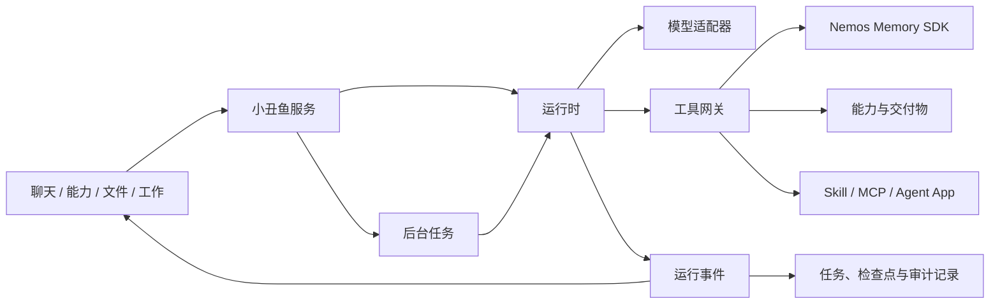

# 小丑鱼运行架构

本文说明小丑鱼如何执行对话、能力任务和后台工作，以及工具权限、恢复、扩展和多智能体协作的边界。

## 设计目标

- 同一套运行时承载聊天、能力和后台任务；
- 工具按当前请求加载，避免无关能力进入上下文；
- 读操作与写操作使用不同权限策略；
- 任务可以取消、重试、恢复和审计；
- 模型、工具、会话、记忆与产品界面保持解耦；
- 多智能体只用于边界清楚、可以独立验证的子任务。

## 总体结构

## 职责边界

1. **界面与路由**负责接收用户目标、显示状态和交付结果，不直接执行工具。
2. **运行时**负责模型与工具循环、上下文、取消、预算和停止条件。
3. **工具网关**负责参数校验、权限判断、超时、结果限制和审计。
4. **能力层**负责组织任务、文件和交付物，并通过标准工具接入运行时。
5. **后台任务**复用同一运行时，避免聊天与长任务形成两套执行规则。

## 一次运行的生命周期

一次执行使用唯一的 `runId`，长期对话或任务使用 `sessionId`。运行按以下顺序进行：

1. 组装当前请求、相关记忆、会话摘要和可用工具；
2. 调用模型并接收工具请求；
3. 校验工具、权限和输入；
4. 执行工具并记录结构化结果；
5. 继续模型推理，或生成最终结果；
6. 保存交付物、停止原因和检查点；
7. 将结果送回原对话或工作页。

刷新界面或重启服务后，系统从持久记录恢复可安全继续的步骤。副作用状态不明确时不会自动重放。

## 工具与权限

每个工具声明名称、用途、输入结构、影响类型和超时：

- **读取**：查询记忆、读取文件、获取公开信息；
- **写入**：修改文件、创建任务、安装扩展、发送消息或提交外部操作。

写操作通过统一动作网关处理。用户在界面中明确发起的操作直接进入校验和审计；由模型提出的高影响操作需要用户确认。未注册工具、未知字段和越权路径会明确失败。

工具调用具有并发、轮次、输出长度和总 Token 上限。取消信号会传递给模型和工具；达到预算后，不再启动新的模型请求或副作用工具。

## 任务、事件与恢复

运行开始、模型完成、工具开始、工具结束、检查点、取消和结束都记录为结构化事件。界面使用这些事件显示真实状态，后台任务也使用相同记录进行恢复。

持久任务支持：

- 进度更新；
- 取消与人工重试；
- 副作用任务在超时、连接中断或进程重启后进入“待核对”，只有确认“已执行”或“未执行”后才能结束或重试；
- 运行租约和超时；
- 幂等入队；
- 检查点恢复；
- 交付确认和重复结果去重。

## 扩展边界

Skill、MCP 和 Agent App 使用可审查清单声明入口、权限、文件范围、网络范围和凭证需求。

- 扩展按请求发现和加载；
- 凭证值不写入扩展清单；
- 第三方进程只获得当前运行需要的最小权限；
- Node 扩展可使用权限沙箱；
- Windows 上的 Python 或本机可执行扩展可使用 AppContainer 隔离；
- 沙箱或依赖不满足时停止执行，不自动退回到未隔离模式。

## 多智能体协作

系统默认使用单智能体和标准工具。只有任务能够按输入、产物和权限边界拆分时，才启用并行研究、执行或复核。

每个子任务拥有独立运行、预算、取消信号和产物引用。汇总阶段只读取必要结果，不复制完整会话，也不能绕过工具权限。

## 记忆使用

运行上下文可以包含与当前目标相关的长期记忆和交付偏好。普通对话使用相关记忆；能力任务可以限制为习惯、文笔、排版和格式偏好。当前请求始终高于历史偏好。

用户记忆、角色自身状态和运行审计使用不同存储边界，避免把模型生成内容写成用户事实。

## 主要实现入口

| 模块 | 作用 |
| --- | --- |
| [runtime.ts](../../../src/agent/runtime.ts) | 模型与工具循环、预算、取消和上下文 |
| [tool-scheduler.ts](../../../src/agent/tool-scheduler.ts) | 工具并发、顺序和超时 |
| [user-action-gateway.ts](../../../src/agent/user-action-gateway.ts) | 用户动作、参数校验和审计 |
| [run-store.ts](../../../src/agent/run-store.ts) | 运行事件、检查点和恢复 |
| [job-queue.ts](../../../src/agent/job-queue.ts) | 持久任务、重试和交付 |
| [extensions.ts](../../../src/agent/extensions.ts) | Skill、MCP 与 Agent App 契约 |
| [orchestrator.ts](../../../src/agent/orchestrator.ts) | 有界多任务编排 |

## 验证重点

自动化测试覆盖模型与工具循环、权限拒绝、取消、预算、持久任务、恢复、交付去重、扩展生命周期、沙箱边界和多任务编排。对外功能仍需同时通过浏览器路径与 Windows 便携客户端验证。
