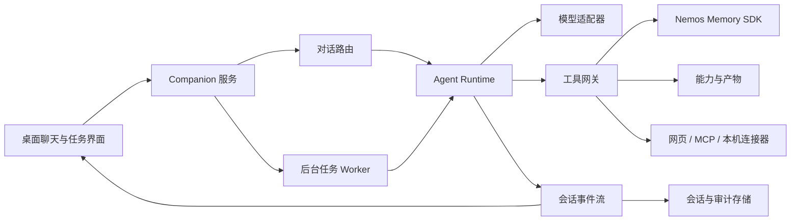

# 小丑鱼 Agent 改造设计

> 状态基线：2026-08-04。本文是 Agent Runtime 方向的当前实现与验收依据，不再使用旧产品路线图或完成百分比判断交付状态。

## 目标

WorkBuddy、remio 与 Buzz 的分析都服务于同一个目标：把 小丑鱼 从“带记忆的角色聊天 + 若干分散能力”改造成“保留陪伴核心、能够可靠做事的本地 Agent”。

本项目不复制任何一个产品的完整形态，只吸收已经被实现验证的设计：

- WorkBuddy：运行前统一组装上下文，技能和工具按需加载，多 Agent 只用于边界清楚的并行任务。
- remio：所有高权限动作经过单一网关；插件、技能和 Agent App 有明确契约；长期记忆整理与主对话分离。
- Buzz：Agent 主循环保持简单；模型、协议和工具解耦；取消、超时、并发、输出和上下文都有硬边界；会话事件可观察。

## 改造前的问题

现有能力已经不少，但执行链路分散：

- [`llm.ts`](../llm.ts) 自己维护联网搜索的模型—工具循环。
- [`server.ts`](../server.ts) 用路由与文本规则直接分流任务、技能和能力请求。
- [`capabilities.ts`](../capabilities.ts) 管理任务、产物和技能，但通过专用 prompt 执行，不是通用工具调用。
- [`capability-tools.ts`](../capability-tools.ts) 已有工具注册表，但多数条目只是能力描述，尚未统一为可执行工具。

结果是同一个概念有多套实现：重试、状态、错误、工具结果、取消和上下文边界难以统一，也不利于后续接入 MCP、浏览器、后台任务和多 Agent。

## 目标结构

职责边界：

1. **对话路由**只判断走普通陪伴回复、确定性快捷操作，还是进入 Agent；不再承载工具执行细节。
2. **Agent Runtime**只负责模型—工具循环、上下文、取消、限制和事件，不知道具体产品业务。
3. **工具网关**是所有副作用的唯一入口，统一做参数校验、权限确认、超时和审计。
4. **能力层**继续管理任务、技能和产物，但把真实执行器暴露成标准工具。
5. **后台 Worker**复用同一个 Runtime，不再创造第二套任务执行逻辑。

## Agent 基座现状

P1—P5 的核心代码已经建立，但“存在接口”不等于“产品闭环完成”。当前真实状态：

| 阶段 | 当前状态 | 验收结论 |
| --- | --- | --- |
| P1 工具网关 | 聊天写操作进入持久审批；客户端明确发起的角色、群组、提醒、任务、扩展、数据源与设置写操作统一审计 | 已闭环；审批、恢复和会话事件作为控制面事实保留在各自持久存储，不伪装成工具调用 |
| P2 会话与事件 | `runId` 与长期 `sessionId` 已分离；追加式事件日志、持久检查点和安全续跑已闭环 | 已闭环 |
| P3 后台任务 | 定时任务只读发现后幂等入队；租约、取消、人工重试、持久交付账本、客户端确认与消息级 `jobId` 去重已具备 | 已闭环 |
| P4 Skills / MCP | 官方 MCP stdio、运行级隔离、短期凭证代理、Node 权限沙箱、Windows LPAC 非 Node 沙箱、持久信任状态，以及开发者模式扩展管理页已具备 | 已闭环 |
| P5 多 Agent | 小丑鱼可按需发起 2—4 位专家协作，固定硬 Token 预算、复核汇总、质量检查、真实 Token 与费用估算并通过持久交付账本回到聊天 | 已闭环 |

已经接入的基础模块：

- [`runtime.ts`](../../../src/agent/runtime.ts)：通用模型—工具循环、重复调用熔断、轮次上限、上下文接力，以及跨轮次和恢复检查点连续累计的模型调用 / Token 用量与硬预算停止。
- [`tool-scheduler.ts`](../../../src/agent/tool-scheduler.ts)：只读工具限流并行；一旦同批含写操作，整批顺序执行；结果按原调用顺序回填。
- [`user-action-gateway.ts`](../../../src/agent/user-action-gateway.ts)：把管理页已明确点击的写操作送入同一运行时；不重复弹窗，但保留校验、超时、结构化事件和审计记录。
- [`types.ts`](../../../src/agent/types.ts)：模型、工具、事件、运行结果和上下文接力的稳定契约。
- [`llm.ts`](../llm.ts)：原先两套智谱普通/流式工具循环已经改为共用 `AgentRuntime`，联网搜索成为标准只读工具。
- [`agent-runtime.test.ts`](../../../tests/unit/agent-runtime.test.ts)：覆盖多轮循环、并发顺序、写操作串行、重复调用、上下文接力和工具轮次限制。
- [`companion-agent-chat.test.ts`](../../../tests/unit/companion-agent-chat.test.ts)：覆盖 Companion → Agent Runtime → 联网搜索 → 最终回答的完整适配链路。

### 当前运行约束

- 最多 4 个模型回合，前 2 回合允许模型选择工具。
- 默认最多 3 个只读工具并行。
- 同一批调用中出现写工具时全部串行，避免副作用竞态。
- 单个工具默认 90 秒超时，工具可覆盖自己的超时。
- 工具文本结果有长度上限，保留头尾而不是无限占用上下文。
- 连续 3 轮完全相同的工具调用会停止，避免死循环和重复扣费。
- 支持 `AbortSignal` 取消，并向界面发送运行、模型和工具事件。`maxTotalTokens` 到达后不再执行待调用的副作用工具或发起下一轮模型请求。
- 超长上下文可通过摘要接力；摘要失败或次数达到上限时再做有边界的历史裁剪。

### P1 工具网关已落地

- [`input-validation.ts`](../../../src/agent/input-validation.ts) 在执行器边界校验工具输入；缺少必填字段、类型错误和未知字段都会作为工具错误返回模型。
- [`capability-tools.ts`](../capability-tools.ts) 的真实来源连接器已转换为按请求加载的 `AgentTool`，普通闲聊不会挂载无关工具。
- [`companion-agent-tools.ts`](../companion-agent-tools.ts) 把记忆召回、人格任务列表和人格产物列表接入同一个 Runtime；用户、人格与可见 scope 由 Engine 注入，工具不能自行扩大权限。
- 写工具默认拒绝执行，只有 `authorizeTool` 明确允许后才会进入执行器；授权决定、调用参数、结果和非敏感发起者字段通过结构化事件进入同一审计流。
- `better-sqlite3` 已升级到支持 Node 24 的 `12.10.0`，完整单元测试可以真实覆盖 SQLite 路径。

### P2—P5 基础实现

- [`run-store.ts`](../../../src/agent/run-store.ts) 以追加式 JSONL 事件日志保存 run、round、tool call、tool result、停止原因、handoff 与检查点，并从事件重建状态。启动时把未终结运行标成 interrupted；只读或尚未执行的安全步骤自动续跑，副作用状态不明确时停下人工核对。日志默认只保留工具摘要，并清理常见密钥和令牌。
- [`job-queue.ts`](../../../src/agent/job-queue.ts) 提供持久队列、启动恢复、租约、协作式执行超时、检查点、取消、幂等键、受控重试与交付确认。带副作用的任务不会自动重放，人工重试必须显式确认；需要回到聊天的成功结果只有收到客户端 ACK 后才从待交付列表移除。
- [`extensions.ts`](../../../src/agent/extensions.ts) 定义 Skill、MCP 与 Agent App 的机器清单、权限、启停、升级、卸载和审计契约；工具只在请求命中后发现和加载。
- [`orchestrator.ts`](../../../src/agent/orchestrator.ts) 提供有界 DAG 调度。子任务拥有独立运行、硬 Token 预算和取消信号，只通过产物引用共享结果，失败被隔离在依赖分支内。
- [`server.ts`](../server.ts) 暴露 `/api/agent/runs`、`/api/agent/jobs`、`/api/agent/events`、`/api/agent/extensions` 与 `/api/agent/orchestration`，后台 Worker 与聊天复用同一 Agent Runtime。
- [`web/index.html`](../web/index.html) 增加 Agent 运行中心；SSE 事件流实时刷新检查点，断线时轮询兜底。长任务入队后聊天仍可继续，刷新或重启后状态仍可查看；聊天接收结果后向服务端确认，未确认结果会在恢复后继续交付。

## 从三个参考实现吸收的具体规则

### 1. 上下文不是一个不断变长的 Prompt

运行上下文按层组装：角色与安全规则、当前用户请求、相关长期记忆、会话摘要、命中的技能、当前可用工具。没有命中的技能不加载全文，大型工具结果先限长，长期会话用摘要接力。

### 2. 所有工具必须声明影响类型

每个工具至少声明：名称、说明、输入结构、`read/write` 影响类型和超时。`write` 包括发消息、改文件、创建日程、发布、付款、删除与外部提交；这些操作后续统一进入确认与审计策略。

### 3. 单一动作网关，拒绝未知动作

参考 remio 的 syscall 边界，小丑鱼 后续不允许模型直接触达服务内部函数。工具调用先经过注册表和参数校验；未注册工具、未知字段和越权路径明确失败，不做模糊猜测。

### 4. 运行、会话与工具进程隔离

每次模型—工具循环都有唯一 `runId`，审批、检查点、恢复、审计和 MCP 子进程都以它为边界。`sessionId` 表示长期对话或任务会话，同一会话可以连续产生多次运行；记忆可见范围仍由会话 scope 决定，不会因一次运行结束而丢失。

### 5. 事件是界面和审计的共同语言

界面不依赖字符串猜测 Agent 状态。运行开始、模型完成、工具开始、工具结束、上下文接力和运行结束都通过结构化事件表达；持久化后可用于恢复、调试、任务面板和审计。

### 6. 多 Agent 是受控能力，不是第一层抽象

系统仍优先使用单 Agent + 标准工具链。只有当任务可以按明确输入、产物和权限边界拆分时，才使用研究、执行、复核等子任务；子 Agent 仍通过同一 Runtime 和工具网关运行。

## 实施状态与验收

### P1：统一工具网关

- [x] 把 `capability-tools.ts` 中已有真实执行器转换为 `AgentTool`。
- [x] 为工具输入增加运行时校验。
- [x] 给写操作增加默认拒绝、持久审批、客户端“允许一次 / 拒绝”和审计字段。
- [x] 客户端明确发起的个人设置、模型 Key、角色、头像、联系人、群组、提醒、能力、Skill、任务、扩展和私域数据源写操作通过显式用户动作网关执行；用户点击即授权，不重复弹窗，但复用参数校验、超时、事件和运行审计。
- [x] 离线聊天不再绕过网关直接创建能力或任务；未连接模型时明确告知未执行。
- [x] 让联网、记忆、任务和产物通过同一 Runtime 的按需工具执行。
- [x] 将小丑鱼的 Skill 安装/更新改为请求级写工具；批准后才读取 URL 或本机文件，其他角色不挂载该工具。
- [x] 确认 `server.ts`、`capabilities.ts` 只保留确定性快捷路由与任务编排，不再维护第二套模型—工具循环。

当前状态：只读工具已统一；聊天中的“创建能力 / 常规任务”“安装 / 更新 Skill”和“多角色协作”进入持久审批。客户端明确发起的设置与管理写操作，以及聊天中明确指定角色称呼的写操作，都由显式用户动作网关执行并写入同一 Agent 运行记录，不会重复要求确认。审批状态、运行恢复、会话历史和计划任务触发记录属于系统控制面事件，继续使用各自的持久存储，不把它们伪装成用户工具调用。

### P2：持久会话与事件日志

- [x] 保存 session、run、round、tool call、tool result、stop reason 和 handoff。`runId` 唯一标识一次执行，`sessionId` 可关联同一长期对话中的多次执行。
- [x] 客户端刷新或服务重启后能恢复任务状态并标记 interrupted。
- [x] 从安全检查点继续模型—工具循环；重启后无待确认副作用的运行自动续跑，待审批写操作在用户确认后续跑。
- [x] 日志不保存密钥，敏感工具结果默认脱敏并仅保存摘要。

当前状态：事件日志是可回放的运行事实源；客户端可继续安全中断，服务启动会自动恢复无待确认副作用的运行。若写操作已经获批但缺少终态事件，系统明确阻止重放，避免重复副作用。

### P3：后台任务

- [x] 长任务进入持久队列，Worker 复用 `AgentRuntime`。
- [x] 支持取消、执行超时、租约恢复、重试策略、检查点和结果产物。
- [x] 聊天界面通过结构化事件流展示任务进度；服务端保存待交付结果，客户端显示成功后再确认。

完成标准：已满足。能力定时任务和港股提醒先进行只读到期发现，再按“任务 + 触发周期”幂等入队；失败或取消的副作用任务不会被下一次扫描静默重建，只能由用户人工重试。重启后队列与待交付结果均从本机文件恢复，客户端确认后才结束交付。服务端保证未确认结果至少一次送达；客户端把 `jobId` 写入聊天记录并在再次收到同一任务时只补发 ACK、不重复插入气泡，因此“已显示但确认失败”也不会造成可见重复。

### P4：技能、MCP 与 Agent App 契约

- [x] 技能继续以 `SKILL.md` 为人类可审查入口，并增加机器可验证清单。
- [x] MCP 工具定义支持延迟发现与加载。
- [x] 接入官方 MCP stdio transport/provider；按 Agent 运行独占子进程，默认仅继承安全环境变量和清单明确声明的变量名。
- [x] 复杂能力采用 `manifest + API schema + runtime` 结构，安装前校验契约和权限。`runtime` 只保存命令、参数和环境变量名，不保存密钥值。
- [x] 敏感环境变量不再允许直接注入第三方 MCP；清单改用 `runtime.credentials` 声明凭证来源、允许的 HTTPS 地址前缀、HTTP 方法、请求头和前缀。子进程只获得短期环回代理令牌，真实密钥由主进程按范围代为注入，运行结束立即撤销。
- [x] Node MCP 可启用 `runtime.sandbox.type = node-permission`：只开放清单声明的读取/写入路径，禁止创建子进程和 Worker，并阻止通过 `NODE_OPTIONS` 绕过。
- [x] 沙箱清单必须明确声明 `network: deny | unrestricted`；便携客户端随包携带经过 SHA-256 校验的独立 Node 26.5.0 沙箱运行时，`deny` 会转交该运行时执行并核对真实版本。主服务继续使用 Node 24，避免改变 `better-sqlite3` 等原生依赖 ABI。
- [x] 本地可执行扩展保存 `restricted / unsandboxed-confirmed / blocked` 信任状态；旧记录没有确认凭据时不再自动绑定 provider。
- [x] 真实 MCP 子进程测试已验证 Node 沙箱拒绝未授权网络，并在独立运行时缺失、版本不符或低于 Node 25 时失败关闭。
- [x] Python 与直接可执行 MCP 可启用 `runtime.sandbox.type = windows-appcontainer`：Windows LPAC 只授权清单声明的文件路径，Job Object 限制子进程，并按清单拒绝或允许网络。
- [x] 便携客户端随包携带经 SHA-256 校验的 Python 3.14.6 embeddable 运行时与 `ClownfishSandboxHost.exe`；缺少宿主、运行时或版本不符时失败关闭，不退回未沙箱执行。
- [x] 真实 Python MCP 测试已验证：允许路径可读写，未声明路径、外网、本机回环与子进程均被拒绝。
- [x] 开发者模式提供扩展清单 JSON 导入、新建、预检查、安装、编辑升级、停用、重新启用和卸载；本机可执行与未沙箱执行分别二次确认。
- [x] 扩展启动失败原因直接显示在运行中心；停用会关闭并移除 provider，重新启用会创建新 provider，拒绝或失败的安装 / 升级不会遗留运行时资源。
- [x] 真实 Companion 服务接口测试覆盖无效清单、双重确认、安装、升级、provider 生命周期与卸载；无头 Edge 覆盖同一客户端操作路径和 720px 窄窗口布局。

当前状态：开发者可在运行中心审查和管理扩展清单；普通模式只展示状态，不暴露安装与卸载入口。带本地执行入口的 MCP 清单只有在安全状态不是 `blocked` 时才会在安装或重启后绑定 provider，运行时错误会保留并显示。工具发现使用短生命周期进程，执行进程按 `runId` 隔离并支持空闲回收、容量上限、取消和超时。Node MCP 由独立 Node 26.5.0 权限运行时限制文件、写入、子进程、Worker 和网络，并可使用按运行撤销的短期凭证代理。Python 与直接可执行 MCP 由 Windows LPAC 宿主管理，依照清单授予路径和网络能力；禁网模式同时拒绝外网与本机回环，避免绕过隔离访问主服务。LPAC 不使用环回凭证代理，需要真实 Key 的扩展应选择 Node 权限沙箱或内置连接器。两条沙箱路径都在运行时缺失、版本不符或进程无法启动时失败关闭。实现依据为 [Microsoft AppContainer / LPAC 官方样例](https://github.com/microsoft/SandboxSecurityTools/tree/main/LaunchAppContainer) 与 [AppContainer 隔离说明](https://learn.microsoft.com/windows/win32/secauthz/appcontainer-isolation)。

### P5：受控多 Agent

- [x] Orchestrator 只拆分和汇总，不绕过工具权限。
- [x] 子任务有独立运行、预算、产物和取消信号，并保留所属编排会话。
- [x] 共享结果走结构化事件或产物引用，不复制整段历史。
- [x] 汇总每个子任务的真实模型调用次数与输入 / 输出 Token，并对任务完成率、可用交付和最终复核生成可解释质量分。
- [x] 按任务类型下发硬 Token 预算；模型调用会收到剩余输出额度，预算耗尽后停止下一轮和未执行的副作用。
- [x] 依据维护日期为 2026-08-02 的智谱国内文本价格表，将实际输入 / 输出 Token 换算为人民币估算金额；未知模型明确计为未定价。

当前状态：DAG 执行内核、请求级委派入口、角色白名单、固定子任务预算和最终复核节点已经接通。委派本身属于写操作，需要“允许一次”；队列使用运行级幂等键避免模型在同一次执行中重复入队。小丑鱼复核后的最终结果已通过服务端交付账本回到聊天，运行中心可查看质量分、Token、模型调用次数和费用估算。专家研究与小丑鱼复核使用不同硬 Token 预算；预算耗尽会生成结构化停止事件，并在副作用工具执行前截断。价格只对当前维护表中已知的智谱模型估算，未知模型不会伪造金额。

## 不变量

- 小丑鱼 的关系记忆与角色自我状态继续分开存储。
- 模型不能直接写数据库、文件或外部服务。
- 工具错误必须回到模型形成可见反馈，不能静默吞掉。
- 取消后历史仍保持合法的 assistant tool call / tool result 配对。
- 工具结果无论并行完成顺序如何，都按模型原调用顺序进入历史。
- 所有循环、并发、输出、上下文和后台执行都有上限。
- 任何真实副作用都要能回答：谁发起、调用了什么、参数是什么、结果是什么、是否确认。
