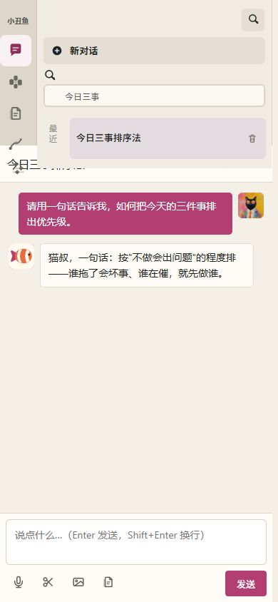

# 小丑鱼网页版真实检查：10 类用户、10 轮

- 日期：2026-08-08
- 环境：本机服务 `http://127.0.0.1:8787`
- 版本：`fa2a397` 之后的当前工作区
- 方法：每轮采用不同用户目标和行为，实际点击、输入、上传、启动任务、删除、恢复、下载和切换小屏；只清理本轮创建的临时对话、文件和重复任务，保留生成结果作为证据。
- 成功标准：用户能找到入口、完成目标、看懂状态、拿到真实文件；页面不虚报成功，错误可恢复，隐私和删除边界清楚。

## 结论

核心闭环已经成立：新建对话、三种工作方式、自动命名、文件上传、对话交接、能力选择与执行、结果保存、工作文件、垃圾桶、记忆控制和重复任务都能实际使用。本轮还真实生成并下载了一份可打开的 DOCX，文件包含有效的 `word/document.xml`。

但当前还不能称为稳定交付，主要不是能力缺失，而是三个关键断点：

1. 390 像素小屏下，搜索侧栏与对话标题、正文发生明显重叠。
2. 办公文件页显示“已导出为 DOCX”，但浏览器没有产生下载事件，下载目录也没有新增文件；界面出现了假成功。
3. 能力页“文件”中的“继续编辑”点击后没有进入办公文件页，而工作页的结果下载能够成功。

此外，重复任务表单仍暴露已经决定不做的出行、酒店能力和内部名称 `aihot`；首页仍保留语音入口和设置入口，与此前产品决策不一致。

## 本轮修正与复测

上述问题已在同一工作区完成修正：

- 能力文件的“继续编辑”现在会真实进入办公文件页，并把结果保存为可编辑工作副本；已用现有 DOCX 结果复测通过。
- 办公文件导出改为“先生成、再保存”：支持系统保存位置选择时，只有文件写入并关闭成功后才显示“文件已保存”；不支持时才退回浏览器下载。下载接口已真实生成 2,008 字节 DOCX，文件头为有效 ZIP/DOCX `50-4B-03-04`。
- 390 像素布局改为由侧栏实际高度推开正文，不再使用固定高度叠放；搜索增加明确关闭按钮。
- 键盘从搜索框按一次 Tab 会进入“关闭搜索”，不再停留在搜索框；浏览器复测焦点为 `closeConversationSearch`。
- 周报、材料、摘要和管理层摘要优先进入“写正式文档”；原失败样例已重新复测并正确选择该能力。
- 重复任务只显示 13 个当前对外能力，名称与能力页一致；出行、酒店、餐馆和 `aihot` 不再出现。
- 运行记录会优先使用用户目标；旧记录能从原始输入恢复时也会补出可辨认标题，无法恢复的记录只显示“对话记录”或“任务执行”。
- 首页语音按钮、首页设置按钮和已废弃的群聊成员设置已从用户界面隐藏；模型连接和数据管理仍可从需要它们的专业页面进入。
- 能力文件现在对所有结果统一提供“预览、继续编辑、下载”。

复测结果：TypeScript 构建通过；完整自动化测试由 506 项增加为 508 项，`508/508` 全部通过。移动端结构已按 390 像素失败样例修正，但仍建议最终安装包在真实手机宽度或窄窗口下再做一次人工视觉确认。

## 设计检查基线

本轮将小丑鱼视为面向普通用户和专业用户的本地工作入口。用户雇用它完成的工作是：从一句话或一个文件开始，连续处理，并获得可以继续编辑或下载的结果。最大的疑虑不是“能力够不够多”，而是“我点了以后是否真的完成、文件是否真的拿到、我的内容是否留在本机”。因此本轮优先检查完整闭环、真实状态、恢复路径、小屏和键盘，而不是只看页面是否好看。

## 第 1 轮：完全新手——先把入口点一遍

**行为**

- 查看首页和首次引导。
- 依次进入任务、能力、办公文件和工作。
- 分别切换“直接聊聊”“完成任务”“学习辅导”。

**结果**

- 四个主入口均能到达对应页面。
- 三种对话方式的标题、说明和示例会同步变化。
- 新手可以不理解专家、能力或项目，直接从一句话开始。

**发现**

- 首页入口名为“任务”，页面主体却是对话；对新用户来说，“任务”比“新对话”更重。
- 首页仍有“切换语音条”和“设置”，与此前“不需要语音对话能力、右上角设置可取消”的决定不一致。

## 第 2 轮：日常轻度用户——问一句并找回来

**行为**

- 新建对话。
- 输入“请用一句话告诉我，如何把今天的三件事排出优先级”。

**结果**

- 小丑鱼正常回复，没有停在加载状态。
- 对话自动命名为“今日三事排序法”，标题能够表达内容。
- 回复保持日常聊天语气，没有进入专家长文。

## 第 3 轮：办公室职员——上传材料并交给能力

**行为**

- 在聊天区上传 Markdown 周报材料。
- 输入“整理成三点管理层摘要，必须保留风险项”。
- 点击“交给能力”。
- 另测 JPG 图片上传与移除。

**结果**

- Markdown 文件显示为待发送附件；JPG 显示为待发送图片，均可移除。
- 交接后保留了目标、附件、当前分支的完整原文和上下文提要。
- 页面明确写出“已带入 2 条完整原文和一份上下文提要”。

**发现**

- 该目标被自动分配到“梳理复杂问题”，而不是“写正式文档”；模糊任务的自动分配仍可能选错。
- 对话已经开始后，三种方式的切换入口消失。这符合“新建时选择方式”的方向，但界面没有说明当前对话已经锁定为何种方式。

## 第 4 轮：学生——验证教学状态

**行为**

- 新建对话并选择“学习辅导”。
- 提问“为什么负数乘负数会变成正数，请先问我一个问题再讲解”。

**结果**

- 对话自动命名为“负负得正原理讲解”。
- 系统先提出诊断性问题，没有直接倾倒答案。
- 页面不暴露老师姓名，符合“老师可以不知道是谁”的决定。

## 第 5 轮：产品经理——让系统自动选能力并完成任务

**行为**

- 输入“把项目周报整理成结构清晰的正式文档”。
- 点击“自动选择能力”。
- 上传周报材料并开始执行。

**结果**

- 自动选择“写正式文档”，默认结果为可编辑 Word。
- 任务进入后台，显示进度，可离开页面。
- 任务最终完成，并生成 DOCX 结果。

**判断**

- 目标表达清楚时自动选择准确；表达成“摘要、梳理”时准确率明显下降，需要用任务产物和动词共同判断，而不是只看单个关键词。

## 第 6 轮：程序员与重度用户——开发项目和重复任务

**行为**

- 直接选择“开发项目”。
- 查看完成修改、只读检查、项目路径和安全边界。
- 新建、保存并删除“真实检查临时任务”。

**结果**

- 开发流程明确为“理解项目、完成修改、运行检查、交付结果”。
- 用户无需命令行；页面明确限制项目目录，并说明不会读取密钥、删除文件、推送、发布或部署。
- 没有“交给某个角色完成”的选择。
- 重复任务可以保存和删除，数量从 1 变 2，再恢复为 1。

**发现**

- 重复任务能力列表仍包含“动车/航班出行方案”“酒店/餐馆预订方案”，与明确的不做范围冲突。
- 列表同时出现“演示文稿、文档稿、产品设计、任务工作台、aihot”等内部或旧名称，与能力页“做 PPT、写正式文档、设计产品界面”不一致。
- “每隔几轮对话”是内部实现语言，不是普通用户能理解的触发条件。

## 第 7 轮：文档重度用户——打开、删除、恢复和永久删除

**行为**

- 打开论文 PDF。
- 删除工作副本并立即撤销。
- 再次删除，从垃圾桶永久删除。

**结果**

- PDF 成功读取，原始版式通过内嵌预览保留。
- 删除后垃圾桶计数从 0 变 1，出现“撤销”。
- 撤销后文件和编辑状态恢复。
- 永久删除前出现确认框，确认后垃圾桶恢复为 0。
- 原 PDF 没有被修改或删除，处理的是本机工作副本。

## 第 8 轮：需要交付文件的管理者——结果、预览和下载

**行为**

- 查看已完成任务和能力文件页。
- 尝试从能力文件继续编辑。
- 新建办公文稿并导出 Word。
- 查看工作页的结果与运行记录。
- 从工作结果页下载生成的 DOCX。

**结果**

- 已完成任务和版本记录均能找到。
- 工作结果页的下载成功：下载目录新增 3,645 字节 DOCX，压缩包含 8 个条目和有效 `word/document.xml`。
- 能力文件页对非 PPT 结果只提供“预览、继续编辑”，没有直接下载；必须转到工作结果页才能下载。

**严重问题**

- 能力文件页点击“继续编辑”后 URL 仍停在 `/capabilities#files`，没有打开 `/office?artifact=...`。
- 办公文件页点击“导出”后显示“已导出为 DOCX”，但 15 秒内没有下载事件，下载目录也没有新增文件。这是虚假成功状态。

**运行记录问题**

- 大量聊天记录统一显示为“对话处理”，缺少对话标题、方式或摘要，重度用户无法区分和排查。

## 第 9 轮：隐私敏感用户——记忆与设置

**行为**

- 进入记忆页。
- 查看长期偏好、修正和忘记入口。
- 打开设置。

**结果**

- 记忆页不显示原始归档，只展示整理后的事实、经历与习惯。
- 当前只显示整理后的长期偏好，主体归属清楚；报告不记录本机偏好原文。
- 未发现角色名、用户主体或角色主体混用残留。
- 设置中不再提供专家角色配置，保留模型连接、记忆与数据和开发者模式。

**发现**

- 设置仍包含“群聊与成员”；首页也仍保留设置按钮。需要重新确认这是否还是当前产品需要，而不是历史结构残留。

## 第 10 轮：键盘用户与小屏重度用户——搜索、删除和响应式

**行为**

- 打开对话搜索，搜索“今日三事”。
- 打开结果并删除本轮创建的测试对话。
- 将视口切换为 390 × 844。
- 连续使用 Tab 检查焦点移动。

**结果**

- 搜索能过滤到目标对话，无结果时有明确提示。
- 对话删除前有确认框，删除后目标从列表消失。

**严重问题**

- 小屏截图中，搜索侧栏覆盖对话标题，标题文字与内容区域发生重叠；当前不是可接受的移动布局。
- 自动化连续 Tab 后焦点一直停在搜索框，没有进入对话列表或正文操作。需要再做一次真实键盘人工复核；在复核前不能宣称键盘路径通过。

## 问题清单

| 优先级 | 问题 | 真实影响 | 建议 |
| --- | --- | --- | --- |
| 高 | 办公文件导出显示成功但没有文件落盘 | 用户以为文件已经保存，实际可能丢失交付物 | 只有捕获到真实下载或保存成功后才显示成功；嵌入式客户端增加专用保存通道 |
| 高 | 390px 小屏侧栏与正文重叠 | 手机和窄窗口无法稳定阅读、操作 | 小屏改成单层抽屉；打开搜索时隐藏或推开正文标题，不允许两层占同一空间 |
| 高 | 能力文件“继续编辑”无响应 | 结果无法顺畅进入下一步加工 | 为该链接增加导航回归测试，并验证 `/office?artifact=` 真正加载结果 |
| 高 | 重复任务暴露明确不做的出行、酒店能力 | 对外承诺与真实产品不一致 | 从用户可见注册表移除，不只隐藏入口 |
| 中 | 重复任务使用内部名称和 `aihot` | 普通用户不知道选择什么，产品显得未完成 | 复用能力页唯一的用户名称和说明 |
| 中 | 模糊目标会自动选错能力 | 用户拿到错误结果形式 | 路由同时判断目标、材料类型和期望产物；低置信度时只给 2 个候选 |
| 中 | 运行记录大量显示“对话处理” | 无法区分、恢复和排查历史 | 使用对话自动标题，并补充方式与一行摘要 |
| 中 | 首页仍保留语音与设置入口 | 与当前精简方向冲突 | 按最新产品决定删除，或说明它们仍必须存在的原因 |
| 中 | 能力文件页的下载入口不一致 | 用户在“文件”页反而找不到下载 | 所有可下载结果都显示下载；继续编辑作为次要操作 |
| 待人工复核 | 搜索框可能形成键盘焦点陷阱 | 纯键盘用户无法继续操作 | 用真实键盘复核；若复现，检查搜索层的 Tab 捕获逻辑 |

## 通过项

- 四个主入口可到达。
- 三种对话方式工作正常。
- 日常对话回复和自动命名通过。
- 教学状态会先提问再讲解。
- Markdown、JPG 和 PDF 上传/读取通过。
- 对话交接携带完整原文、提要、目标和附件。
- 明确目标的自动能力选择通过。
- 能力后台执行、完成和生成结果通过。
- 开发项目的四步流程和安全边界通过。
- 工作文件删除、撤销、恢复、永久删除通过。
- 重复任务保存和删除通过。
- 记忆页隐藏原始归档，主体未发现混用。
- 工作结果页真实下载通过，生成 DOCX 结构有效。

## 证据

- [首页截图](evidence/2026-08-08-round-1-home.png)
- [390 像素小屏截图](evidence/2026-08-08-round-10-mobile.png)
- [上传材料样本](evidence/2026-08-08-round-3-upload.md)
- [表格上传样本](evidence/2026-08-08-round-7-data.csv)

## 数据清理

- 已删除本轮创建的日常对话、学习对话和空白对话。
- 已删除临时重复任务。
- 已永久删除办公文件测试副本，垃圾桶为 0。
- 保留本轮生成的能力结果及运行记录，用于复现“结果下载”和“继续编辑”问题。

## 验证边界

- 已真实触发模型对话和能力执行。
- 已真实上传 Markdown、JPG 和 PDF。
- 已真实下载能力生成的 DOCX，并验证文件结构。
- 办公文件导出未能落盘，因此标记为失败，不以页面提示替代事实。
- 键盘焦点路径由自动化复现为停留在搜索框，仍需人工键盘补验。
- 本轮未测试麦克风权限、真实语音识别和外部第三方账号，因为当前产品方向已决定不以语音为主，也没有授权外部账号操作。
- TypeScript 构建通过；完整自动化测试 506/506 通过。首次受限运行因 Windows 禁止创建测试子进程而全部报 `spawn EPERM`，在允许子进程的环境重跑后全部通过。
